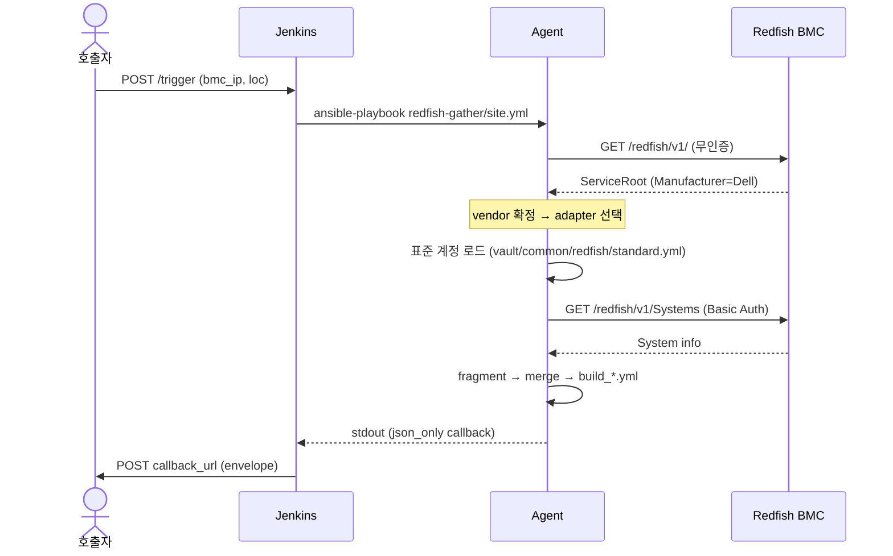

# mermaid-visualization

정본은 rule 41 이다. 이 스킬은 그 진입점이고, 세 가지 상황을 한 곳에서 다룬다.
2026-08-13 이전에는 기능 흐름 작성 / 일반 시각화 / 변경 후 갱신이 세 스킬로
나뉘어 있었는데, 셋 다 rule 41 을 옮겨 적은 것이라 합쳤다.

## 상황 1 — 기능 흐름을 새로 그린다

큰 단위 기능(새 vendor, 새 섹션, 새 채널, Jenkinsfile 추가)이면 의무다.

**AS-IS / TO-BE 쌍**으로 낸다 (R9). 신규 기능이라 AS-IS 가 없으면 TO-BE 만 내되
"기존 없음"이라 적는다. 변경인데 TO-BE 만 있으면 왜 바꿨는지 추적이 안 된다.

## 상황 2 — 일반 흐름을 그린다

목적에 맞는 타입을 고른다 (R1).

| 보여주려는 것 | 타입 |
|---|---|
| 분기·판단 | flowchart |
| 시간축 상호작용 (callback, Vault 로딩) | sequenceDiagram |
| 상태 전이 (precheck 단계, gather lifecycle) | stateDiagram-v2 |
| 데이터 구조 (sections × fields × baseline) | erDiagram |
| 벤더 매트릭스 | sankey |
| 후보안 비교 | quadrantChart |
| 진행 이력 | timeline / gantt |

flowchart 로 전부 밀어 넣지 않는다. 특히 시간축과 상태 전이는 타입이 맞으면
읽는 비용이 확 준다.

## 상황 3 — 코드가 바뀌어 그림이 낡았다

1. 변경 commit 범위와 겹치는 문서의 mermaid 블록을 찾는다
2. 변경 전 그림을 AS-IS 로 남긴다
3. TO-BE 를 갱신한다
4. 상단·하단 문맥도 같이 고친다 — 그림만 바꾸고 설명이 남으면 더 헷갈린다
5. 성공/실패/재시도(R8)와 벤더 분기(R10)가 여전히 맞는지 다시 본다

## 공통 필수 항목

- 모든 style/classDef 에 `color:#000, stroke-width:2px` (R2).
  안 넣으면 보는 사람 테마에 따라 글씨가 안 보인다
- 색상 — OK/신규 `#dfd`/`#3c3`, NG/실패 `#fdd`/`#c33`,
  분기 `#ffd`/`#c93`, 외부 시스템(Redfish·SSH·WinRM·vSphere) `#def`/`#39c` (R3)
- 노드 ID 는 의미 기반 (`START_GATHER` `CHECK_AUTH` `FAIL_PRECHECK`).
  `A` `B1` 같은 약어만 쓰면 나중에 무슨 노드인지 못 찾는다 (R5)
- 30 노드 / 6 단계 이내. 넘으면 subgraph 로 묶거나 분할 (R7)
- **성공만 그리지 않는다.** 실패·재시도 경로가 없으면 장애 분석에 못 쓴다 (R8)
- 벤더 분기는 subgraph 로 (`profile-dell` `profile-hpe` …) (R10)
- 위에 `> 이 그림이 말하는 것: <한 문장>`, 아래에 `> 읽는 법: …` (R11)
- 3색 이상이면 범례 subgraph (R12)
- `classDef` 와 `style` 을 같은 노드에 겹쳐 쓰지 않는다 (R13)
- 상태 표시는 이모지가 아니라 ASCII 태그 — `[OK]` `[FAIL]` `[SKIP]`
  (rule 23 R8. 이모지는 폰트마다 폭이 달라 정렬이 깨진다)

## server-exporter 예시

그릴 때 자주 쓰는 도메인 흐름 — Jenkins 4-Stage, 3채널 수집,
precheck 진단(도달[TCP 응답 OR ICMP 응답] → 프로토콜 → 인증),
Redfish 표준 계정 인증과 복구, adapter 자동 선택.

## 검수

`flowchart-reviewer` 에 위임한다. 자기가 그린 걸 자기가 통과시키지 않는다.

## 적용 rule / 관련

- rule 41 (정본), rule 23 R8 (ASCII 태그), rule 70 (문서 갱신)
- agent: `flow-visualizer`, `flowchart-reviewer`
