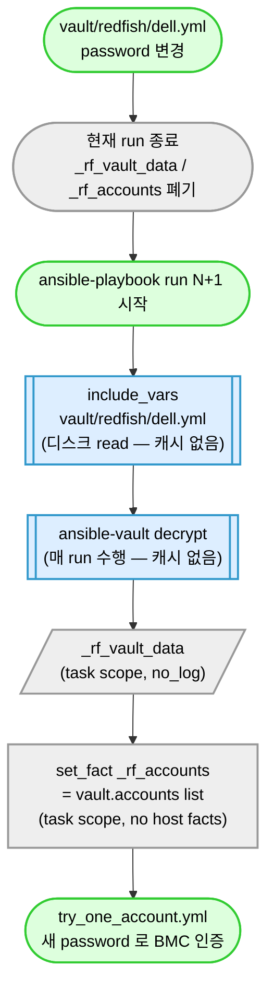

# 21. Vault 운영 — 자격증명 관리

## 누가 읽나

server-exporter 가 SSH / WinRM / vSphere / Redfish 에 접속할 때 쓰는 **자격증명** 을 다루는 사람.

가장 자주 묻는 3가지:

1. vault 파일을 고쳤는데 다음 실행에 정말 반영되나?
2. 정기 회전 (rotate) 어떻게 하나?
3. 새 벤더 추가 시 vault 어떻게 만드나?

이 문서를 끝까지 읽으면 다 푼다.

---

## 1. "vault 고쳤는데 정말 반영됨?" — 한 줄 답

**그렇다. 다음 `ansible-playbook` 실행부터 바로 적용된다.** 별도 캐시 무효화 작업 / 재기동 / 환경변수 갱신 필요 없다.

이유: server-exporter 는 vault 결과를 어디에도 캐시하지 않는다. 매 실행마다 ansible-vault 가 디스크에서 읽어서 복호화한다.

## 2. 의심될 때 직접 확인하는 3가지

운영 중 "정말 반영된 게 맞나?" 가 의심되면 아래 §4.1 의 3 단서 (include_vars `cacheable` 부재 / `set_fact` host facts 부재 / vault decrypt 캐시 부재) 를 차례로 확인한다. 모두 "0 결과" 가 정상.

---

## 3. Vault 종류

### 3.1 현재 코드가 여는 경로 (2026-08-12~) — Location 축

Credential 선택 Contract:

```
OS      = location + os_type   →  vault/<location>/os/<linux|windows>.yml
ESXi    = location             →  vault/<location>/esxi.yml
Redfish 표준 = 전역           →  vault/common/redfish/standard.yml      (수집에 쓰는 계정)
Redfish 복구 = location+vendor →  vault/<location>/redfish/<vendor>.yml  (표준 계정 복구용)
```

Generation / Model / Firmware 는 **선택축이 아니다** (세대를 아는 시점이 인증 이후라 순환이다).

디렉터리 깊이 = 선택축 개수. ESXi 만 평 파일인 이유는 2번째 축이 없기 때문이다.

| 채널 | 경로 | 선택축 |
|---|---|---|
| Linux | `vault/<loc>/os/linux.yml` | location + os_type |
| Windows | `vault/<loc>/os/windows.yml` | location + os_type |
| ESXi | `vault/<loc>/esxi.yml` | location |
| Redfish (표준 수집) | `vault/common/redfish/standard.yml` | **없음 — 전역 1벌** |
| Redfish (복구) | `vault/<loc>/redfish/<vendor>.yml` | location + vendor (canonical 9종) |

- `<location>` 은 `common/vars/locations.yml` 에 등록된 ID 만 쓸 수 있다. Jenkins 가
  `-e se_location=<id>` 로 전달하고, resolver 가 registry 에 없는 값이면 **경로를 만들지 않는다.**
- `<vendor>` 는 `common/vars/vendor_aliases.yml` 의 canonical 키만 쓸 수 있다.
- **다른 Location / 다른 Vendor 로 넘어가는 폴백 경로는 코드에 존재하지 않는다.**
  `ich + dell` 이 실패해도 `chj + dell` 이나 `ich + hpe` 를 시도하지 않는다.

**vendor 9종**: dell / hpe / lenovo / supermicro / cisco / huawei / inspur / fujitsu / quanta

### 3.2 이전 flat 경로 (2026-08-12 삭제 완료)

| 채널 | 이전 경로 |
|---|---|
| Linux | `vault/linux.yml` |
| Windows | `vault/windows.yml` |
| ESXi | `vault/esxi.yml` |
| Redfish | `vault/redfish/{vendor}.yml` |

**현재 코드는 이 경로를 읽지 않는다.** 런타임 폴백도 없다 — 신규 경로가 준비되지 않으면
"조용히 옛 파일로 성공" 하는 대신 명시적으로 실패한다
(`failure_code=CREDENTIAL_SET_UNAVAILABLE`). 이관 실패를 감추지 않기 위한 의도된 설계다.

**2026-08-12 삭제 완료.** 실장비 6대 재검증 후 제거했고, 제거 후에도 정상 수집을 확인했다
(`tests/evidence/2026-08-12-redfish-standard-account-separation.md`).
`vault/.lab-credentials.yml` 은 resolver 대상이 아니라 유지한다.
이전 동작 복원이 필요하면 git 이력에서 되살린다.

### 3.3 Location 추가 절차

1. `common/vars/locations.yml` 에 3줄 추가 (`<id>: { agent_label: <label> }`)
2. `vault/<id>/...` 생성 + 암호화
3. Jenkins 에 해당 label agent 등록

**코드 수정 0줄.** Python / Playbook / Jenkinsfile 어느 것도 바뀌지 않는다.

### 3.3.1 Redfish 는 계정 축이 둘이다 (2026-08-12)

```
vault/common/redfish/standard.yml   ← 표준 수집 계정 (role: primary 1개) — **전역 1벌**
vault/<loc>/redfish/<vendor>.yml    ← 복구 계정 (role: recovery 만)
```

- **표준 수집 계정**: 모든 Location + 모든 Vendor 공통. 최종 Gathering 은 **반드시** 이
  계정으로 수행된다. 이 파일 하나만 고치면 전 사이트·전 벤더에 반영된다.
- **복구 계정**: 목적이 수집이 아니라 **표준 계정을 만들거나 되살리는 것**이다.
  Location + Vendor 별로 다르다.
- 복구 계정으로 수집한 결과가 정상 결과로 나가는 경로는 **없다.** 복구가 확인되면
  표준 계정으로 재인증·재수집한다.
- 복구 vault 에 `role: primary` 나 legacy `ansible_user` 를 두지 마라 — 표준 계정
  중복이 되고, 코드는 그것을 표준 대용으로 쓰지 않는다.

OS / ESXi 는 축이 하나뿐이라 구조가 그대로다 (`<loc>/os/<type>`, `<loc>/esxi`).

비밀번호를 바꿀 때: 표준 계정은 `vault/common/redfish/standard.yml` **1곳**,
복구 계정은 해당 Location+Vendor 파일만 고친다.

### 3.4 flat → Location 이관 절차 (4단계)

> **현재 상태 (2026-08-12)**: 4 Location (`ich / chj / yi / git`) × 12 = 48개 +
> 전역 표준 1개 = **49개**. flat 12개는 삭제됐다.
> 복구 자격은 아직 **4곳이 같은 값**이다 (Pilot 단계). 아래 절차는 **운영 값으로
> 분리할 때**의 정본이다.
> Pilot 결과: `tests/evidence/2026-08-12-location-vault-jenkins-pilot.md`,
> 표준/복구 분리: `tests/evidence/2026-08-12-redfish-standard-account-separation.md`
>
> **Pilot 예외가 정당했던 이유**: Pilot 의 검증 목표는 값이 아니라 **경로 분기**
> (`loc` → agent label → `se_location` → vault 경로 → 복호화 → 인증) 였다. 값을 4벌로
> 새로 만들면 값 오타와 경로 버그가 뒤섞여 원인 분리가 안 된다. 값을 고정해 두면
> `credential_scope` 차이만으로 경로 동작을 판정할 수 있다.
> **운영 전환 시에는 이 예외를 쓰지 마라** — 아래 1단계대로 신규 작성한다.

Location 별 실제 계정 값이 서로 다를 수 있으므로 이관은 **파일 이동이 아니라 신규 작성**이다.
기존 flat vault 를 3벌 복사하는 것은 잘못된 값을 3곳에 심는 일이다.

**1단계 — 신규 Vault 작성** (운영 담당자)

```bash
# Location × 채널별 실제 계정 값을 확정한 뒤 각각 신규 생성
mkdir -p vault/<loc>/os vault/<loc>/redfish
ansible-vault create vault/<loc>/os/linux.yml
ansible-vault create vault/<loc>/esxi.yml
ansible-vault create vault/<loc>/redfish/dell.yml
# ... 필요한 vendor 만큼
```

파일 내부 스키마는 **바뀌지 않았다** (§6). 바뀐 것은 파일이 놓이는 경로뿐이다.
`accounts` 배열 **순서 = 인증 시도 순서**다 — 코드가 재정렬하지 않는다.

**2단계 — 구조 / 암호화 검증**

```bash
# 어떤 경로가 아직 비었는지 (복호화 없이)
python scripts/ai/vault_decrypt_check.py --layout-only

# 복호화 + accounts 스키마 + role + label 정합 (Secret 값은 출력하지 않는다)
SE_VAULT_PASSWORD='<마스터 키>' python scripts/ai/vault_decrypt_check.py
```

> `scripts/ai/vault_decrypt_check.py` 는 `.gitignore` 대상 **로컬 도구**다 (cycle-018 결정 —
> 당시 마스터 키가 코드에 하드코딩돼 있었다). 2026-08-12 에 하드코딩을 제거하고 키를
> `SE_VAULT_PASSWORD` / `--password-file` 로만 받도록 바꿨다. gitignore 해제 여부는
> 사용자 결정 사항으로 남겨 두었으므로, fresh clone 에는 이 파일이 없을 수 있다.

검사 항목: `$ANSIBLE_VAULT` 헤더 / 복호화 성공 / `accounts[]` 각 항목의
`username·password·label·role` / `role ∈ {primary, recovery, secondary}` /
`primary` 1개 이상 / Redfish label 이 vendor 허용 집합(§6.5)과 정합 /
`accounts[0].role != primary` 경고.

**3단계 — 실장비 Pilot**

Location 1곳 × 채널별 1대씩 실제 수집을 돌려 확인한다:

- `diagnosis.details.credential_scope` 가 기대 값인가 (`<loc>/os/linux` 등)
- 요청 target 수 == 결과 envelope 수 (rule 11)
- 실패 경로: 없는 Location 으로 빌드 → `Resolve Location` stage 에서 즉시 실패
  (agent 대기 없음)

**Unit test 통과는 실장비 검증이 아니다.**

**4단계 — flat vault 제거** (별도 커밋)

3단계가 확인된 뒤에만. 삭제 대상: `vault/linux.yml`, `vault/windows.yml`,
`vault/esxi.yml`, `vault/redfish/*.yml` 9개.
(`vault/.lab-credentials.yml` 은 제외 — resolver 대상이 아닌 lab 전용 평문 파일)

## 4. Vault 자동 반영 메커니즘 (rule 27 R6)

### 4.1 자동 반영 보장 3 단서

vault 변경 시 다음 run 자동 반영을 보장하는 3 단서. 회전 후 / 의심 시 검증:

#### 단서 1: include_vars cacheable 옵션 부재

```bash
grep -rn 'cacheable' common/tasks/credential/
# 기대: 0 결과
```

- `cacheable: yes` 시 fact_cache (Redis) 에 host facts 로 저장 → 다음 run 에서도 stale vault 사용 위험
- 정본: `common/tasks/credential/load_one.yml` (`include_vars` 호출에 `cacheable` 옵션 없음 — 매 run 디스크 read)

#### 단서 2: set_fact host facts 미등록

```bash
grep -rn 'cacheable' common/tasks/credential/ redfish-gather/tasks/ common/tasks/normalize/
# 기대: 0 결과
```

- `_cl_vault_data` / `_cred_accounts` / `_rf_accounts` 변수는 task scope 만
- host facts (`ansible_facts.*`) 또는 `cacheable: yes` 등록 금지
- 정본: `redfish-gather/tasks/load_vault.yml:64-81` (`set_fact` 에 `cacheable` 옵션 없음)

#### 단서 3: ansible-vault decrypt 캐시 부재

```bash
grep -rn 'vault_password_file\|vault_identity\|VAULT_PASSWORD_FILE' ansible.cfg
# 기대: vault_password_file 만 있어야 함 (decrypt 캐시 옵션 없음)
```

- Ansible 은 vault decrypt 결과 캐시 안 함 (default)
- vault password file 만 있고 decrypt 결과 캐시 옵션 없으면 매 run 새로 decrypt

### 4.2 자동 반영 처리 과정 (Mermaid)

> 이 그림이 말하는 것: vault/redfish/{vendor}.yml 파일을 매 ansible run 마다 새로 읽어 `_rf_accounts` 로 정규화한다. 캐시 없음 — 다음 run 자동 반영.



### 4.3 단일 run 내 vault 변경 (반영 안 됨)

- 한 run 시작 후 vault 파일을 mid-run 변경해도 같은 run 내 반영 안 됨 (이미 include_vars 한 후 task 변수 캐시)
- 다음 run 부터 반영
- → **회전은 ansible-playbook 종료 후 수행 권장**

## 5. Vault 회전 시나리오

상세 절차는 `rotate-vault` skill 참조. 본 절은 운영 요약.

### 5.1 시나리오 A: ansible-vault password rekey (vault 자체 password 변경)

```bash
# 1. 백업
cp vault/redfish/dell.yml /tmp/dell-vault.bak

# 2. 새 password 로 rekey
ansible-vault rekey vault/redfish/dell.yml

# 3. Jenkins credentials 갱신 (server-gather-vault-password — Secret text)
# 4. 검증
ansible-vault view vault/redfish/dell.yml
```

### 5.2 시나리오 B: 외부 BMC 사용자 자격증명 회전

```bash
# 1. 외부 시스템 (BMC iDRAC / iLO / XCC / CIMC) 에서 사용자 password 변경
#    (BMC 운영자가 수행 — server-exporter 는 read-only)

# 2. 새 자격증명으로 vault 다시 encrypt
ansible-vault edit vault/redfish/dell.yml
#    안에서 vault_redfish_password 또는 accounts[].password 갱신

# 3. 검증 — 다음 ansible run 에서 자동 반영
ansible-playbook redfish-gather/site.yml \
  -i ... -e "target_ip=10.x.x.1" \
  --vault-password-file ~/.vault_pass

# 4. evidence 기록
echo "$(date +%Y-%m-%d): Dell vault rotation (BMC user 변경)" \
  >> tests/evidence/vault-rotation-log.md
```

### 5.3 시나리오 C: 새 vendor vault 추가

`rule 50 R2` 9단계 중 4단계.

```bash
ansible-vault create vault/redfish/{vendor}.yml
# 안에 입력:
# accounts:
#   - username: "infraops"
#     password: "..."
#     label: "primary"
#     role: "primary"
#   - username: "admin"
#     password: "..."
#     label: "recovery"
#     role: "recovery"
```

## 6. 회전 주기 권고

| Vault | 권장 주기 |
|---|---|
| ansible-vault password (마스터) | 분기 |
| BMC / Linux / Windows / ESXi 자격증명 | 반기 또는 사고 시 |
| 새 vendor vault | 추가 시점 (rule 50 R2 9단계) |

## 6.5. 9 vendor recovery 자격 매트릭스 (cycle 2026-05-11 — M-A1~A6)

> 사용자 명시 (2026-05-11): vendor 공장 기본 자격으로 vault 임시 recovery 자격을 추가. primary `infraops` 비밀번호는 전 vendor 통일 (평문은 vault 안에만 — 2026-08-11 Phase 6-B 로 본 문서에서 제거).
>
> 본 매트릭스는 **공장 기본 / 매뉴얼 default** 출처. 사이트 BMC 가 customer-specific 자격으로 변경되면 recovery 는 BMC reset 후 회복 시점에만 작동.

### 9 vendor 통일 정책

| 항목 | 값 |
|---|---|
| primary username | `infraops` (모든 vendor 통일) |
| primary password | `<vault/redfish/{vendor}.yml accounts[0].password>` (평문 미기재 — 2026-08-11 Phase 6-B) |
| vault password (ansible-vault) | `<Jenkins Credential: server-gather-vault-password>` (평문 미기재 — 2026-08-11 Phase 6-B) |
| recovery 정책 | vendor 공장 기본 자격 + (기존) lab/사이트 운영 자격 (Additive) |

### vendor 별 recovery 자격 (공장 기본)

| vendor | recovery 자격 | label | source (rule 96 R1-A) |
|---|---|---|---|
| **Dell** | root / calvin | `dell_fallback_2` | Dell PowerEdge / iDRAC 공식 매뉴얼 (역사적 default) |
| **HPE** | admin / admin | `hpe_factory` | HPE iLO User Guide (legacy default — iLO5+ 첫 로그인 강제 변경) |
| **Lenovo** | USERID / PASSW0RD | `lenovo_factory` | Lenovo XCC / IMM User Guide ('0' = 숫자 zero) |
| **Supermicro** | ADMIN / ADMIN | `supermicro_factory` | Supermicro BMC User Guide (일부 펌웨어는 sticker 별도) |
| **Cisco** | admin / password | `cisco_factory` | Cisco UCS / CIMC User Guide |
| **Huawei** | Administrator / Admin@9000 | `huawei_factory` | Huawei iBMC Redfish API user guide |
| **Inspur** | admin / admin | `inspur_factory` | Inspur server BMC user guide |
| **Fujitsu** | admin / admin | `fujitsu_factory` | Fujitsu PRIMERGY iRMC user guide |
| **Quanta** | admin / admin | `quanta_factory` | Quanta QCT server user guide |

### 기존 vendor 의 다중 recovery (보존 — Additive only)

5 사이트 검증 vendor 는 cycle 2026-04-29 ~ 2026-05-06 누적된 lab / 사이트 운영 자격이 보존됨:
- **Dell**: 4 recovery (dell_fallback_1, dell_fallback_2, dell_current, lab_dell_root)
- **HPE**: 3 recovery (hpe_fallback, hpe_current, hpe_factory)
- **Lenovo**: 3 recovery (lenovo_fallback, lenovo_current, lenovo_factory)
- **Supermicro**: 1 recovery (supermicro_factory — cycle 2026-05-11 신규)
- **Cisco**: 2 recovery (cisco_current, cisco_factory)

### vendor default 계정 자동 생성 메커니즘

primary `infraops` 자격이 BMC 에 없으면 (= 사이트 BMC 초기 상태) recovery 자격으로 fallback → `account_service.yml` 가 자동으로 BMC 에 `infraops` 계정 + vault 의 비밀번호 + `Administrator` role 로 PATCH/POST.

처리 순서:

```text
try_one_account.yml (accounts[0] primary 시도)
  └─ 401 (BMC 에 infraops 없음) → _rf_auth_observations 에 {role:'primary', status:401} 기록
       ↓
try_one_account.yml (accounts[1+] recovery 시도)
  └─ 200 (BMC 공장 기본 자격 → _rf_used_account.role='recovery')
       ↓
collect_standard.yml → _rf_primary_auth_rejected = true  (primary 관측이 401 일 때만)
       ↓
account_service.yml (진입 조건 — 정본은 redfish-gather/site.yml)
  [정정 2026-08-13] 종전 4개 조건 서술은 stale 이다. 특히 1·2번은 현재 코드와 반대다 —
  복구 계정으로 수집한 결과는 정상 결과가 될 수 없으므로 `_rf_used_account.role` 은
  진입 조건이 아니고, `_rf_collect_ok` 는 **false** 일 때만 진입한다.

  현재 정본 (site.yml `_rf_account_reconcile_allowed`):
  1. _rf_collect_ok == false              ← 표준 계정으로 수집이 실패했다
  2. _rf_primary_auth_rejected == true    ← 401 실증. timeout/TLS/5xx/403 은 진입 안 함
  3. 해당 Location+Vendor 의 recovery 후보 1개 이상
  └─ redfish_gather mode='account_provision'
       target_username='infraops', target_password=<vault accounts[0].password>,
       target_role='Administrator'
       ↓
BMC AccountService POST/PATCH → infraops 계정 생성/복구
       ↓
다음 ansible run: primary 자격 (infraops) 으로 정상 인증
```

→ **사이트 BMC 가 customer-specific 자격으로 변경된 경우**: recovery 매칭 안 됨 → BMC reset 필요 (사이트 운영자) → reset 후 공장 기본 자격 회복 시점에 자동 생성 작동.

### dryrun 정책

- `_rf_account_service_dryrun` — [정정 2026-08-13] 고정 기본값 `false` 가 아니다.
  변수를 **주지 않으면** `not _rf_account_reconcile_allowed` 에서 파생된다. 즉
  진입 조건이 성립했을 때만 실쓰기이고 그 외에는 시뮬레이션이다
  (정본: `redfish-gather/tasks/account_service.yml` `_rf_account_service_dryrun_effective`).
- override: `-e _rf_account_service_dryrun=true` (변수를 명시했을 때만 override 로 인정)
- `ansible-playbook --check` 도 dryrun 으로 접힌다 (module.check_mode → dryrun)
- 신규 사이트 BMC 1대 처음 적용 시 권장: dryrun ON 으로 시뮬레이션 1회 → dryrun OFF 로 실 적용

## 6.6. adapter label naming convention (cycle 2026-05-11 — M-A7)

> 본 절은 cycle 2026-05-11 M-A7 (commit `a82afc4b`) 의 30 adapter 전수 정합 결과를 정본 reference 로 고정.

### 1:1 정합 의무

adapter (`adapters/redfish/{vendor}_*.yml`) 의 `credentials.recovery_accounts[*].vault_label` 은 vault (`vault/redfish/{vendor}.yml`) 의 `accounts[*].label` 와 **1:1 정합** 의무.

- **정본** = vault `accounts[*].label` (운영자 결정)
- adapter `vault_label` 은 vault 정본을 참조만 — adapter 가 vault 에 없는 label declare 시 `account_service.yml:31-41` label 매칭 chain 에서 skip 후 username fallback 으로 우회 (기능은 동작하나 label 매칭 활성화 안 됨 + 시도 회수 증가)
- 회귀 검증: `tests/unit/test_adapter_vault_label_consistency.py` (30 adapter × vendor 별 허용 set 정적 검증)

### naming convention (cycle 2026-05-11 정착)

| label 패턴 | 의미 | 보유 vendor |
|---|---|---|
| `{vendor}_factory` | 공장 기본 자격 (vendor 매뉴얼 default — BMC 초기 상태에서 사용) | 9 vendor 모두 (Dell 제외 — `dell_fallback_2` 로 표기) |
| `{vendor}_current` | 현재 운영 자격 (cycle 2026-04-29 ~ 2026-05-06 누적된 사이트 운영 default) | Dell / HPE / Lenovo / Cisco |
| `{vendor}_fallback` / `{vendor}_fallback_N` | 히스토리컬 fallback (이전 cycle 운영 자격 또는 다중 history 보존) | Dell (`fallback_1`, `fallback_2`) / HPE / Lenovo |
| `lab_{vendor}_root` | lab 환경 root 자격 (사이트 외 lab 검증 전용) | Dell only (`lab_dell_root`) |

### vendor 별 적용 결과 (30 adapter 정합 완료)

| vendor | adapter 수 | label entries | 정본 |
|---|---|---|---|
| Dell | 4 (idrac/idrac8/idrac9/idrac10) | `dell_fallback_1`, `dell_fallback_2`, `dell_current`, `lab_dell_root` | §6.5 매트릭스 |
| HPE | 7 (ilo/ilo4/ilo5/ilo6/ilo7/superdome_flex/csus_3200) | `hpe_fallback`, `hpe_current`, `hpe_factory` | §6.5 매트릭스 |
| Lenovo | 4 (bmc/imm2/xcc/xcc3) | `lenovo_fallback`, `lenovo_current`, `lenovo_factory` | §6.5 매트릭스 |
| Supermicro | 8 (bmc/x9/x10/x11/x12/x13/x14/ars) | `supermicro_factory` | §6.5 매트릭스 |
| Cisco | 3 (bmc/cimc/ucs_xseries) | `cisco_current`, `cisco_factory` | §6.5 매트릭스 |
| Huawei | 1 (ibmc) | `huawei_factory` | §6.5 매트릭스 |
| Inspur | 1 (isbmc) | `inspur_factory` | §6.5 매트릭스 |
| Fujitsu | 1 (irmc) | `fujitsu_factory` | §6.5 매트릭스 |
| Quanta | 1 (qct_bmc) | `quanta_factory` | §6.5 매트릭스 |

총 30 adapter (`redfish_generic.yml` 제외 — generic fallback 은 vendor 미상으로 `recovery_accounts: []` 유지).

### 변경 원칙 (rule 13 R5 + rule 96 R1-B — Additive only)

adapter `recovery_accounts` 변경은 **Additive only** 의무:

- **Allowed**: vault accounts 신규 추가 후 adapter 에 동일 label entry **추가** (Additive)
- **Allowed**: adapter declare entry 순서 변경 (시도 순서는 vault accounts 순서로 결정 — adapter 순서 변경은 cosmetic)
- **Forbidden**:
  - adapter 의 기존 label entry **삭제 / 리네임** (호환성 cycle 외)
  - vault 에 존재하지 않는 label declare (회귀 테스트 차단)
  - envelope `data.bmc.account_service` shape 변경 (rule 13 R5)
  - 호출자 시스템 파싱 변경 (rule 96 R1-B)

### 신규 adapter 추가 시 체크리스트

1. vault `vault/redfish/{vendor}.yml` 의 `accounts[*].label` 확인 (정본)
2. adapter `credentials.recovery_accounts` 에 vault label 와 동일 entry 추가
3. 각 entry 에 `role: recovery` 명시
4. `tests/unit/test_adapter_vault_label_consistency.py` 회귀 PASS 확인
5. (vendor 신규 시) §6.5 매트릭스 + 본 절 vendor 별 적용 결과 표 갱신

## 7. accounts 정규화 (P1 cycle 2026-04-28)

vault file 내 accounts list 순서 = multi-account fallback 시도 순서. 별도 role 정렬 없음.

```yaml
# vault/redfish/dell.yml (예시)
accounts:
  - username: "infraops"
    password: "..."
    label: "primary"
    role: "primary"      # provision target
  - username: "admin"
    password: "..."
    label: "recovery"
    role: "recovery"     # provision 진입용
```

→ `_rf_accounts` 로 정규화. legacy 호환 (`ansible_user` / `ansible_password` → primary 1개).

## 8. 의심 / 사고 대응

### 8.1 자동 반영 안 되는 의심

- 단서 3개 (4.1) 검증 → 0 결과 / 옵션 없음 확인
- ansible run 1회 더 시도 (mid-run 변경은 반영 안 됨)
- vault 파일 디스크 sync 확인 (`ls -la vault/redfish/{vendor}.yml` → mtime 업데이트)
- ansible-vault decrypt 명령 직접 실행 → 새 내용 read 가능 확인

### 8.2 일부 host 인증 실패

- BMC 측 password sync 안 됨 → 외부 시스템 운영자에게 escalate
- multi-account fallback 의 recovery (`accounts[1+]`) 가 동작하는지 확인
- evidence 기록

### 8.3 vault edit 도중 swap 파일 잔재

- `vault/.swp`, `vault/redfish/.{vendor}.yml.swp` 파일 잔재 시 절대 commit 금지
- `.gitignore` 에 `*.swp` 등록 (이미 적용)

## 9. 검증 절차 (회전 후 의무)

1. `ansible-vault view <vault>` — 새 password 로 read 가능
2. dry-run: `ansible-playbook --syntax-check redfish-gather/site.yml`
3. **자동 반영 3 단서 검증** (rule 27 R6) — 4.1 명령 3개
4. 실장비 1대 대상 본 수집 시도 (target_type별)
5. callback 결과 envelope 최상위 `vendor` 값 정상
6. console log 평문 password 노출 없음 확인

## 10. 보안 주의

- 회전 절차 중 임시 평문 password 메모는 메모리 only (파일 / clipboard 제거)
- Jenkins credentials 는 server-exporter 외부 (Jenkins controller 권한 최소)
- 회전 이력 = `tests/evidence/vault-rotation-log.md` (날짜 + 대상만, password 자체는 절대 기록 안 함)
- ansible-vault password file (`~/.vault_pass`) 은 `chmod 600`

## 11. 관련 문서

| 문서 | 용도 |
|---|---|
| `rule 27 R6` | vault 자동 반영 단서 3개 정본 |
| `rule 50 R2` | 새 vendor 추가 9단계 |
| `skill: rotate-vault` | 회전 절차 상세 |
| `skill: add-new-vendor` | vendor 추가 시 vault 생성 단계 |
| `skill: debug-precheck-failure` | auth 실패 시 |
| `redfish-gather/tasks/load_vault.yml` | vault 로딩 정본 코드 |
| `docs/03_agent-setup.md` | Agent 보안 설정 |
| `docs/ai/references/ansible/ansible-vault.md` | ansible-vault 명령 reference |

---

## 다음 단계

| 다음 작업 | 문서 |
|---|---|
| Jenkins 마스터의 vault credential 등록 | [01_jenkins-setup.md](01_jenkins-setup.md) §7 |
| Agent 노드 설치 (vault 패스워드 파일 배치) | [03_agent-setup.md](03_agent-setup.md) |
| precheck 4단계 (인증 실패 단계 진단) | [11_precheck-module.md](11_precheck-module.md) |

## 자주 막히는 곳

| 증상 | 원인 / 해결 |
|------|------------|
| 새로 만든 vault 가 반영 안 됨 | `cacheable: yes` / fact_caching 충돌 의심 — rule 27 R6 단서 3개 검증 |
| `Decryption failed` | `.vault_pass` 파일의 패스워드와 vault 가 일치하지 않음 |
| `Could not find credentials entry` | Jenkins Credentials 에 `server-gather-vault-password` 미등록 |
| ansible-vault edit 실패 | 파일이 이미 평문이거나 다른 vault password 로 암호화됨 |
