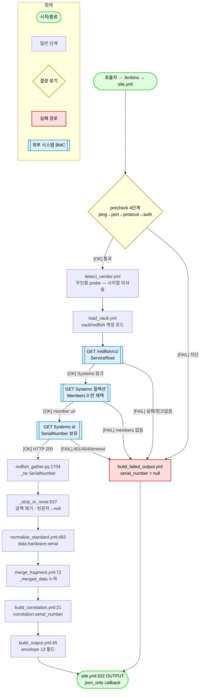

# 시리얼 번호 수집 — 코드 기준 전수 추적 (Redfish / Linux / Windows / ESXi)

> **작성일**: 2026-08-11 (Part I) / **확장**: 2026-08-11 (Part II — 전 벤더 × 3채널)
> **범위**: **시리얼 번호(Serial Number)** 하나만. 다른 필드는 흐름 설명에 필요한 최소한만 언급한다.
> **기준**: **문서가 아니라 코드**. 모든 진술에 `파일:라인` 을 붙였고, 문서(`docs/` 문서)는 근거로 쓰지 않았다.
> **라인 번호 기준 커밋**: `5d0c857b` (2026-08-11). 코드가 바뀌면 라인 번호는 밀린다 — 함수명/문자열로 재확인할 것.
> **검증**: 실장비 미러 4대(`tests/fixtures/redfish/real_*`) 오프라인 재생 + fixture 39 디렉터리 전수 스캔 + 실 Jenkins 실행 envelope(`tests/evidence/2026-04-29-full-lab-sweep/`) 재추출.
>
> **Part I·II 는 사실 기록 전용이다.** 어떤 값을 써야 하는지, 코드를 고쳐야 하는지는 **판단하지 않는다**.
> `권장 정본` / `수정 필요 여부` 같은 설계 판단은 두 Part 의 범위 밖이다 (사용자 지시, 2026-08-11).
>
> **[MOD] Part III 추가 (2026-08-11)**: 위 조사 결과를 근거로 **Dell 채널만** 1차 교정을 수행했다.
> Part I·II 본문의 "Dell 은 `System.SerialNumber` 를 쓴다" 는 서술은 **교정 전 사실**이며,
> 교정 후 Dell 동작은 **29절 (Part III)** 이 정본이다. 다른 벤더 서술은 전부 유효하다.

## 문서 구성

| Part | 내용 | 절 |
|---|---|---|
| **Part I** | Redfish(BMC) 채널의 시리얼 코드 경로 전수 추적 | 0 ~ 15, 부록 A/B |
| **Part II** | 전 벤더 × 4채널(Redfish/Linux/Windows/ESXi) 사실 조사 | 16 ~ 25 |
| **Part III** | **Dell 1차 교정** (조사 → 설계 결정 → 구현 → 검증) | 29 |

---

## 0. 한 줄 결론

BMC 시리얼의 **정본 경로는 단 하나**다.

```
GET https://<BMC_IP>/redfish/v1/Systems/{첫 멤버}
   → 응답 JSON 의 "SerialNumber"
   → redfish_gather.py:1704  result['serial']
   → normalize_standard.yml:483  data.hardware.serial
   → build_correlation.yml:21-26 correlation.serial_number
```

폴백은 **없다**. System 응답에 `SerialNumber` 가 없으면 `null` 이다 (Chassis / Manager 값으로 대체하지 않는다 — 5절).

---

## 1. 시리얼이 최종 JSON(envelope)에 나타나는 위치 — 전수

정본 envelope 조립: `common/tasks/normalize/build_output.yml:45-63` (13 필드).

### 1-A. 실제로 emit 되는 시리얼 (9곳)

| # | envelope 경로 | 원천 Redfish 필드 | 원천 endpoint | 추출 코드 | envelope 배선 코드 |
|---|---|---|---|---|---|
| 1 | `data.hardware.serial` | `ComputerSystem.SerialNumber` | `Systems/{id}` | `redfish_gather.py:1704` | `normalize_standard.yml:483` |
| 2 | `correlation.serial_number` | (1)의 복사 | — | — | `build_correlation.yml:21-26` |
| 3 | `data.bmc.serial` | `Manager.SerialNumber` | `Managers/{id}` | `redfish_gather.py:1836` | `normalize_standard.yml:502` (passthrough) |
| 4 | `data.memory.slots[].serial` | `Memory.SerialNumber` | `Systems/{id}/Memory/{dimm}` | `redfish_gather.py:2089` | `normalize_standard.yml:544` (passthrough) |
| 5 | `data.storage.physical_disks[].serial` | `Drive.SerialNumber` | `Systems/{id}/Storage/{c}/Drives/{d}` | `redfish_gather.py:2216` | `normalize_standard.yml:198` |
| 6 | `data.network.adapters[].serial_number` | `NetworkAdapter.SerialNumber` | `Chassis/{id}/NetworkAdapters/{a}` | `redfish_gather.py:2891` | `normalize_standard.yml:562` (passthrough) |
| 7 | `data.power.power_supplies[].serial` | `PowerSupply.SerialNumber` | `Chassis/{id}/Power` 또는 `/PowerSubsystem/PowerSupplies/{p}` | `redfish_gather.py:3366` / `:3211` | `normalize_standard.yml:565-570` (passthrough) |
| 8 | `data.hardware.oem.*` (벤더별) | `Oem.<Vendor>.*SerialNumber` | `Systems/{id}` + `Chassis/{id}` | `redfish_gather.py:1350`(lenovo) / `:1378`(cisco) | `normalize_standard.yml:501` (passthrough) |
| 9 | `data.multi_node.*` (CSUS/Superdome 전용) | Partition/Chassis/Manager 각각의 `SerialNumber` | 다중 | `:4031` / `:4132` / `:3749` | `normalize_standard.yml:579` (passthrough) |

### 1-B. 수집은 되지만 envelope 에 **안 나오는** 시리얼 (3곳 — 확인된 사실)

| 대상 | 모듈 내부 수집 여부 | envelope 도달 | 근거 |
|---|---|---|---|
| **CPU 시리얼** (`Processor.SerialNumber`) | 수집함 → `data.processors[].serial_number` (`redfish_gather.py:2019`) | **[NG] 도달 안 함** | Ansible `_data_fragment` 의 `cpu` 블록(`normalize_standard.yml:503-528`)이 per-processor 리스트를 만들지 않는다. 멀티노드 경로 `_normalize_cpu_raw`(`:3926-3963`)도 동일. 실측: `dell_baseline.json` 의 `data.cpu` 키 = `sockets/cores_physical/logical_threads/model/max_speed_mhz/architecture/summary` (serial 없음) |
| **컨트롤러 하위 drive 시리얼** | 수집함 (`:2216`) | **[NG] 도달 안 함** | `normalize_standard.yml:163-172` 의 `controllers[].drives[]` 재구성이 `serial` 키를 뺀다. 같은 원본이 `physical_disks[]`(`:198`)로는 나간다 |
| **Chassis 시리얼 (단일 노드)** | `gather_system` 이 Chassis 를 **fetch 는 함** (`:1660-1663`) | **[NG] 도달 안 함** | 그 응답은 OEM 추출과 manufacturer/model 폴백에만 쓰인다(`:1742-1779`). Chassis `SerialNumber` 를 읽는 코드 자체가 단일노드 경로에 없다. 멀티노드에서만 `:4132` 으로 노출 |

---

## 2. 메인 경로 — `data.hardware.serial` 전 단계 추적

### 단계 0 — 진입점

호출자 → Jenkins → `ansible-playbook redfish-gather/site.yml`.
모듈 탐색 경로는 `ansible.cfg:18` (`library = ./common/library:./redfish-gather/library`), 출력 callback 은 `ansible.cfg:23` (`stdout_callback = json_only`).

### 단계 1 — fragment 초기화

`site.yml:36-38` → `common/tasks/normalize/init_fragments.yml`.

### 단계 2 — precheck (4단계 진단)

`site.yml:41-47` → `common/tasks/precheck/run_precheck.yml`.
실패 시 `site.yml:49-56` 에서 `fail` → 이후 전부 skip → **시리얼은 수집 시도조차 되지 않는다** (10절 실패 경로).

### 단계 3 — vendor 감지 (무인증 probe)

`site.yml:59-60` → `tasks/detect_vendor.yml`.

```yaml
# redfish-gather/tasks/detect_vendor.yml:12-22
- name: "redfish | detect_vendor | probe"
  redfish_gather:
    bmc_ip:   "{{ _rf_ip }}"
    username: ""          # 무인증
    password: ""
```

[INFO] 이 probe 는 모듈 전체를 무인증으로 1회 더 돌린다. 하지만 **probe 의 수집 결과는 시리얼로 쓰이지 않는다** — `detect_vendor.yml:24-76` 이 사용하는 값은 `vendor` / `model` / `firmware` 힌트뿐이다. 시리얼은 단계 6의 인증 수집 결과(`_rf_raw_collect`)에서만 온다.

### 단계 4 — adapter 선택 → vault 프로파일 결정

`site.yml:63-70` (`adapter_loader` lookup) → `site.yml:87-88` → `tasks/load_vault.yml`.
`load_vault.yml:17` 이 `_selected_adapter.credentials.profile` 로 `vault/<loc>/redfish/{profile}.yml` 을 정하고, `:29-36` 에서 로드, `:64-81` 에서 `_rf_accounts` (username/password/label/role 리스트)로 정규화한다.

**시리얼과의 관계**: `Systems/{id}` 는 인증 필요 endpoint 다(`ServiceRoot` 만 무인증). 여기서 자격증명을 못 얻으면 시리얼은 `null` 이 된다.

### 단계 5 — 계정 순차 시도

`site.yml:91-92` → `tasks/collect_standard.yml:57-65` → `tasks/try_one_account.yml`.

```yaml
# redfish-gather/tasks/try_one_account.yml:21-34
- name: "redfish | try_account | attempt"
  redfish_gather:
    bmc_ip:   "{{ _rf_ip }}"
    username: "{{ _try_account.username | default('') }}"
    password: "{{ _try_account.password | default('') }}"
```

성공 판정 `try_one_account.yml:38-40` → 성공분만 `_rf_raw_collect` 로 승격(`:64-75`). 실패 시 5초 backoff(`:97-101`, BMC lockout 회피).

### 단계 6 — 모듈 `main()` 진입

`redfish_gather.py:4990`. gather 모드 흐름:

| 순서 | 코드 | 하는 일 |
|---|---|---|
| 6-1 | `:5064-5066` | `detect_vendor()` → `(vendor, system_uri, manager_uri, chassis_uri, errors, service_root)` |
| 6-2 | `:5077-5083` | `system_uri` 가 없으면 즉시 `status='failed'`, `data={}` 로 종료 → **시리얼 없음** |
| 6-3 | `:5085-5092` | `_collect_all_sections(...)` — 여기서 `gather_system` 이 불린다 |
| 6-4 | `:5108-5114` | `exit_json(data=result_data, ...)` |

### 단계 7 — `system_uri` 결정 (시리얼을 읽을 주소)

`detect_vendor()` (`redfish_gather.py:1111-1183`):

1. `_fetch_service_root()` (`:853-869`) — `GET /redfish/v1/` 를 **무인증**(`_get_noauth`, `:745-772`)으로 시도하고, 실패하면 인증(`_get`)으로 재시도.
2. `systems_uri = root['Systems']['@odata.id']` (`:1128`). 없으면 `system_uri=None` → 시리얼 없음(`:1129-1131`).
3. `_resolve_first_member_uri()` (`:920-934`) — `GET {systems_uri}` 후 **`Members[0]['@odata.id']`** 를 취한다.

> [WARN] **항상 컬렉션의 첫 멤버만** 쓴다(`:934`). 다중 System(nPartition) 장비의 2번째 이후 파티션 시리얼은 단일노드 경로에 안 나오고, `multi_node` 경로(7절)로만 나온다.

실측 URI:

| 장비 | `system_uri` | 시리얼 |
|---|---|---|
| Dell R740 | `/redfish/v1/Systems/System.Embedded.1` | `CNIVC0098G0600` |
| HPE DL380 | `/redfish/v1/Systems/1` | `SGHD3KHHRP` |
| Lenovo SR650 | `/redfish/v1/Systems/1` | `J902E57T` |
| HPE CSUS 3200 | `/redfish/v1/Systems/Partition0` | `SGHD3TLNDD-000` |

### 단계 8 — 섹션 dispatch

`_collect_all_sections()` (`:4408-4451`):

```python
# redfish_gather.py:4432-4435
eff_chassis_uri = _resolve_system_chassis_uri(
    bmc_ip, system_uri, chassis_uri, username, password, timeout, verify_ssl)
return {
    'system': _run('system', gather_system, bmc_ip, system_uri, vendor, *creds,
                   eff_chassis_uri, product_hint),
    ...
```

`_run` 은 `_make_section_runner()` (`:3662-3701`)가 만든 래퍼다. 시리얼 관점에서의 의미:

- `gather_system` 이 errors 를 반환하면 `collected` + `failed` 양쪽에 `system` 이 들어간다(`:3685-3688`).
- 404 만 있고 결과가 비면 `unsupported` 로 분류(`:3682-3684`).
- 예외가 나면 `failed` + `data.system = None` (`:3690-3700`).

### 단계 9 — `gather_system()` — **시리얼을 실제로 읽는 곳**

`redfish_gather.py:1641-1784`.

```python
# :1651  ← 시리얼이 들어 있는 단 하나의 HTTP 호출
st, data, err = _get(bmc_ip, _p(system_uri), username, password, timeout, verify_ssl)
if err or st != 200:
    errors.append(_err('system', f'System 수집 실패: {err or st}'))
    return {}, errors          # :1653-1655  → 시리얼 없음
```

```python
# :1697-1699  빈문자/공백 정규화 헬퍼
def _ne(*keys):
    return _strip_or_none(_safe(data, *keys))

# :1704  ← 시리얼 추출 (정본 1줄)
'serial': _ne('SerialNumber'),
```

`gather_system` 이 하는 두 번째 GET(`:1660-1663`, Chassis)은 **시리얼과 무관**하다 — OEM 추출과 manufacturer/model 폴백 전용(5절).

### 단계 10 — 모듈 → Ansible 변수

`main()` 이 `exit_json(data=result_data)` (`:5108-5114`) 하고, Ansible 은 이를 `_rf_raw_collect` 에 담는다(`try_one_account.yml:32,54`).

```yaml
# redfish-gather/tasks/normalize_standard.yml:7
_rf_d_system:  "{{ _rf_raw_collect.data.system | default({}) }}"
```

### 단계 11 — fragment 로 배선 (`system` → `hardware` 이름 변경)

```yaml
# redfish-gather/tasks/normalize_standard.yml:480-483
hardware:
  vendor:  "{{ _rf_d_system.manufacturer | default(none) }}"
  model:   "{{ _rf_d_system.model        | default(none) }}"
  serial:  "{{ _rf_d_system.serial       | default(none) }}"
```

[INFO] 모듈의 `data.system` → envelope 의 `data.hardware` 로 **이름이 바뀐다**. envelope 의 `data.system` 은 OS 정보용이라 Redfish 에선 대부분 null 이다(`:470-478`).
[INFO] `ansible.cfg:44` 에 `jinja2_native = True` 라 `{{ ... | default(none) }}` 결과가 문자열 `"None"` 이 아니라 **진짜 `None` → JSON `null`** 로 나간다.

섹션 상태 이름 매핑은 `normalize_standard.yml:441-452`(`_rf_proc_map`), `system` 수집 성공 시 `hardware` 를 보강하는 규칙은 `:592`.

### 단계 12 — fragment 누적 병합

`normalize_standard.yml:622-624` → `common/tasks/normalize/merge_fragment.yml:72-106` 재귀 병합 → `_merged_data`.
병합 규칙상 **fragment 값이 `None` 이면 기존 값을 유지**한다(`merge_fragment.yml:82-83, 89-93`). 표준 정규화가 redfish 채널의 유일한 `hardware` 생산자라 실제 충돌은 없다.

### 단계 13 — correlation 생성

```yaml
# common/tasks/normalize/build_correlation.yml:21-26
serial_number: >-
  {{ (_merged_data.hardware.serial | default(none))
     if _merged_data.hardware is defined and _merged_data.hardware is mapping
     else (_merged_data.system.serial_number | default(none))
     if _merged_data.system is mapping
     else none }}
```

redfish 채널은 `hardware` 가 항상 존재하므로 **항상 첫 분기**를 탄다. 두 번째 분기(`system.serial_number`)는 OS/ESXi 채널용이다.

### 단계 14 — envelope 조립 → 출력

`site.yml:233-235` → `build_output.yml:45-63` (`data` = `:62`, `correlation` = `:60`) → `site.yml:237-239` schema_version 주입 → `site.yml:332` **`- name: OUTPUT`** 태스크 → `callback_plugins/json_only.py` 가 이 태스크만 골라 JSON 으로 방출.

---

## 3. HTTP 계층 — 시리얼을 가져오는 실제 요청

`redfish_gather.py:239-278`:

```python
def _get(bmc_ip, path, username, password, timeout, verify_ssl):
    url = f'https://{bmc_ip}/redfish/v1/{path.lstrip("/")}'   # :247
    req = urlreq.Request(url, headers={
        'Authorization': _auth(username, password),           # :251  Basic 인증
        'Accept': 'application/json',                         # :252
        'OData-Version': '4.0',                               # :253
    })
```

| 항목 | 값 | 코드 |
|---|---|---|
| 메서드 | `GET` (읽기 전용) | `:239` |
| 스킴 | 항상 `https` (평문 HTTP 경로 없음) | `:247` |
| 인증 | HTTP Basic (`base64(user:pass)`) | `:211-212` |
| 헤더 | `Accept`, `OData-Version: 4.0` 만. **`User-Agent` 는 의도적으로 없음** (Lenovo XCC 일부 펌웨어가 reject — `:248-249` 주석) | `:250-254` |
| TLS | `_ctx(verify_ssl)` (`:166`), 기본 `verify_ssl=false` (`main()` `:4997`) | `:256` |
| 타임아웃 | 기본 30초 (`:4996`), Ansible 은 `_rf_timeout=30` 전달 (`site.yml:29`) | `:224` |
| 외부 라이브러리 | 없음. `urllib`/`ssl`/`socket`/`json` 만 (rule 10 R2) | `:16, :47` |

경로 정규화 `_p()` (`:368-380`): `@odata.id` 가 문자열이 아니거나 빈 경로로 퇴화하면 `'__invalid_odata_id__'` 로 바꿔 404 로 깨끗이 실패시킨다(`:376-380`).

오류 처리(시리얼이 `null` 이 되는 HTTP 사유):

| 상황 | 반환 | 코드 |
|---|---|---|
| 4xx/5xx | `(code, body, 'HTTP {code}: {reason}')` | `:269-272` |
| 연결 실패 | `(0, {}, 'URLError: ...')` | `:273-274` |
| 타임아웃 | `(0, {}, 'Timeout after {n}s')` | `:275-276` |
| 200 인데 본문이 JSON 아님 | `(200, {}, 'body not JSON')` | `:263-267` |

이 중 무엇이든 `gather_system:1653` 에서 `return {}, errors` → `data.hardware.serial = null` + `errors[]` 에 `section: "system"` 기록.

---

## 4. 값 정규화 — 원본 문자열이 어떻게 변형되는가

시리얼에 적용되는 변형은 정확히 두 개뿐이다.

**(a) `_safe()`** — `redfish_gather.py:382-387`
중첩 키 안전 접근. 중간이 dict 가 아니거나 값이 `None` 이면 `default`(=`None`).

**(b) `_strip_or_none()`** — `redfish_gather.py:537-549`

```python
if value is None:            return None
if not isinstance(value, str): return value      # 비문자열은 그대로
s = value.strip()
return s or None                                 # 공백 제거 후 빈 문자열이면 None
```

즉 **`""` 와 `"   "` 는 `null` 로 정규화**된다. 근거 주석(`:540-542`): Cisco BMC 가 trailing space 를 붙여 emit 하는 사례.

실측 확인: HPE DL380 의 `Systems/1/Processors/1.SerialNumber` 가 `''` → `_ne_p`(`:2002-2004`)로 `None` (12절 트레이스 출력).

> 대소문자 변환·하이픈 제거·prefix 제거 같은 추가 가공은 **없다.** BMC 가 준 문자열이 그대로 나간다.

---

## 5. 폴백 매트릭스 — 시리얼에는 폴백이 없다

`gather_system` 은 폴백 로직을 갖고 있지만, **시리얼은 대상이 아니다**:

```python
# redfish_gather.py:1767-1779
if result['model'] is None and product_hint:        # ServiceRoot.Product → model
    ...
if isinstance(chassis_data, dict):
    if result['manufacturer'] is None:              # Chassis.Manufacturer → manufacturer
        ...
    if result['model'] is None:                     # Chassis.Model → model
        ...
```

| 필드 | 1차 | 폴백 | 코드 |
|---|---|---|---|
| `manufacturer` | `System.Manufacturer` | `Chassis.Manufacturer` | `:1772-1775` |
| `model` | `System.Model` | `ServiceRoot.Product` → `Chassis.Model` | `:1767-1779` |
| **`serial`** | `System.SerialNumber` | **없음** | `:1704` |

실측 근거(HPE CSUS 3200): `Systems/Partition0.SerialNumber='SGHD3TLNDD-000'`, `Chassis/r001u01.SerialNumber='SGHD3TLNDD'` — 서로 다른 값인데 `data.hardware.serial` 은 파티션 값(`SGHD3TLNDD-000`)을 그대로 유지한다. Chassis 값으로 덮이지 않는다.

> [INFO] 이건 버그가 아니라 설계다. Chassis 시리얼(섀시)과 System 시리얼(논리 시스템/파티션)은 다른 식별자다. 다만 **"System 이 시리얼을 안 주면 null"** 이라는 사실은 운영상 알고 있어야 한다.

---

## 6. 부품별 시리얼 상세

### 6-1. BMC 자신의 시리얼 — `data.bmc.serial`

```python
# redfish_gather.py:1836
'serial': _strip_or_none(_safe(data, 'SerialNumber')),
```

- endpoint: `GET {manager_uri}` (`:1805`), `manager_uri` = `Managers` 컬렉션 첫 멤버(`detect_vendor:1141-1144`)
- 2026-06-16 추가(`:1833-1835` 주석). 대부분 vendor(iDRAC/iLO/XCC)는 Manager 가 이 필드를 주지 않아 `null`.
- 실측: Dell/HPE/Lenovo = `None`, HPE CSUS RMC = `'SGHD3TLNDD'`.

### 6-2. DIMM 시리얼 — `data.memory.slots[].serial`

```python
# redfish_gather.py:2089
'serial': _strip_or_none(_safe(mdata, 'SerialNumber')),
```

- endpoint: `GET {system_uri}/Memory` → 멤버별 `GET {system_uri}/Memory/{id}` (`:2039, :2050`)
- `Status.State == 'Absent'` 슬롯은 제외(`:2054-2055`)
- 컬렉션 순회 상한 1024 (`_capped`, `:447-460`, `MAX_COLLECTION_MEMBERS=56`행 `:56`)
- envelope 로는 `normalize_standard.yml:544` 가 slots 를 통째로 passthrough (가공 없음)

### 6-3. 디스크 시리얼 — `data.storage.physical_disks[].serial`

3개 수집 경로가 fallback chain 을 이룬다(`gather_storage:2447-2487`):

| 우선순위 | 경로 | 시리얼 추출 | 비고 |
|---|---|---|---|
| 1 | `Systems/{id}/Storage` (표준) | `:2216` `Drive.SerialNumber` | 정상 경로 |
| 2 | `Systems/{id}/SimpleStorage` (구형 BMC) | `:2122` **하드코딩 `None`** | SimpleStorage 스키마에 시리얼이 없음 |
| 3 | `Systems/{id}/SmartStorage/...` (HPE iLO4 OEM) | `:2421` `PhysicalDrive.SerialNumber` | `:2351-2444` |

- Empty Bay 필터: 용량 0 이거나 이름에 `empty` 포함 시 제외(`:2201-2207`)
- envelope 배선 시 `name+model+serial` 조합으로 dedup (`normalize_standard.yml:191-193`)
- **컨트롤러 하위 `drives[]` 에는 serial 이 빠진다** (`normalize_standard.yml:163-172`) — `physical_disks[]` 만 보유

### 6-4. NIC 카드 시리얼 — `data.network.adapters[].serial_number`

```python
# redfish_gather.py:2891
'serial_number': _safe(adata, 'SerialNumber') or None,
```

- endpoint: `Chassis/{eff_chassis_uri}/NetworkAdapters/{id}` (`:2835-2839`), 실패 시 Systems 경로 fallback(`:4446-4450` 주석)
- 여기만 `_strip_or_none` 이 아니라 `or None` 을 쓴다 → 빈 문자열은 `None` 이 되지만 **trailing space 는 남는다** (다른 필드와 미세하게 다른 정규화)
- 실측: `hpe_csus_3200_baseline.json` → `'MT2210CSUS01'`

### 6-5. PSU 시리얼 — `data.power.power_supplies[].serial`

DMTF 스키마 변천 때문에 두 경로가 있고, 둘 다 나오면 병합한다.

| 경로 | endpoint | 코드 |
|---|---|---|
| legacy | `Chassis/{id}/Power` → `PowerSupplies[]` | `:3366` |
| 신규 | `Chassis/{id}/PowerSubsystem/PowerSupplies/{id}` | `:3211` |
| 병합 | `_merge_power_dual()` | `:3282-3322` |

**시리얼이 dedup 키로 쓰인다** (`:3307-3315`):

```python
_ps_serial = psu.get('serial') or ''
if _ps_serial:
    key = ('serial', _ps_serial)          # 시리얼 있으면 시리얼로만 dedup
else:
    key = ('name_model', psu.get('name') or '', psu.get('model') or '')
```

같은 PSU 를 legacy/subsystem 이 다른 `name` 으로 내보내도 시리얼이 같으면 1개로 합친다. 즉 **PSU 시리얼은 데이터일 뿐 아니라 병합 로직의 입력**이다.

---

## 7. multi_node (HPE CSUS 3200 / Superdome Flex) 시리얼

`manager_layout` (adapter 의 `vendor_notes.manager_layout`, `site.yml:81-84`)이 `rmc_primary` 계열일 때만 활성(`_collect_multi_node_topology:4326-4347`). 그 외 vendor 는 `None` 이라 영향 0.

| envelope 경로 | 원천 | 코드 |
|---|---|---|
| `data.multi_node.partitions[].system.serial` | 각 `Systems/{partition}` 의 `SerialNumber` | `gather_systems_multi:4031` → `gather_system:1704` |
| `data.multi_node.chassis[].serial_number` | 각 `Chassis/{id}` 의 `SerialNumber` | `gather_chassis_multi:4132` |
| `data.multi_node.managers[].bmc.serial` | 각 `Managers/{id}` 의 `SerialNumber` | `gather_managers_multi:3749` → `gather_bmc:1836` |
| `data.multi_node.partitions[].memory.slots[].serial` | DIMM | `_normalize_memory_raw:3999` (slots passthrough) |
| `data.multi_node.partitions[].storage.physical_disks[].serial` | Drive | `_normalize_storage_raw:3852-3857` |

[INFO] 멀티노드 partition 의 `network.adapters` 는 항상 `[]` 다(`_normalize_network_raw:3923`) → **멀티노드 경로에는 NIC 시리얼이 없다.**

컬렉션 전수 순회는 `_resolve_all_member_uris()` (`:937-971`) 사용 — 단일노드의 `_resolve_first_member_uri` 와 대비된다.

실측(`real_hpe_csus3200` 재생):

```
partitions: [('Partition0', 'SGHD3TLNDD-000')]
chassis   : [('RackGroup','SGHD3TLNDD'), ('Rack1', None), ('r001u01','SGHD3TLNDD')]
managers  : [('RMC', 'SGHD3TLNDD')]
```

---

## 8. OEM 시리얼 (벤더 확장 영역)

dispatch: `gather_system:1742-1751` + `_OEM_EXTRACTORS` (`:1575-1583`). 반환값은 `data.hardware.oem` 으로 passthrough (`normalize_standard.yml:501`).

| vendor | 키 | 원천 | 코드 | 실측 결과 |
|---|---|---|---|---|
| Lenovo | `oem.fru_serial` | `Chassis.Oem.Lenovo.FruSerialNumber` | `:1350` | **[WARN] 항상 `null`** — 아래 참조 |
| Cisco | `oem.board_serial` | `System.Oem.Cisco.BoardSerialNumber` → `Chassis.Oem.Cisco.BoardSerialNumber` | `:1378` | fixture 부재로 미확인 |
| Huawei | `bmc.oem_huawei.board_serial` | `Oem.Huawei.BoardInfo.BoardSerialNumber` | `tasks/vendors/huawei/collect_oem.yml:45` | lab 부재 |
| HPE | (없음) | — | `:1247-1298` — HPE extractor 는 시리얼을 뽑지 않음 | 실 raw 에 `Oem.Hpe.PCASerialNumber` 존재하나 **미수집** |
| Dell / Supermicro | (없음) | — | `:1301-1328`, `:1360-1366` | — |

### Lenovo `fru_serial` 이 항상 null 인 이유 (실측 확인)

코드는 `FruSerialNumber` 를 찾는데, 실 XCC 응답에는 그 키가 없다:

```
real_lenovo_sr650  Chassis/1  Oem.Lenovo 키 =
  ['@odata.type','BIOSVendor','BaseBoardManufacturer','FanSpeedBoost','FruPartNumber',
   'LEDs','ProductName','SolutionServiceEnabled','SysEncloseSerialNum','SysEncloseVersion',
   'SystemBoardSerialNumber','SystemEncloseManufacturer','SysvpdSettings']
```

실제 키는 `SystemBoardSerialNumber`(`L1HF531003S`) / `SysEncloseSerialNum`(null) 이다.
저장소 전체에서 `FruSerialNumber` 를 포함한 fixture 는 **0건**이고, `SystemBoardSerialNumber` 는 3개 파일에 있다(`tests/fixtures/redfish/lenovo/chassis.json`, `real_lenovo_sr650/recording.json`, `tests/evidence/2026-06-15-lenovo-sr650-v4-audit.md`).
이미 기존 감사에도 기록돼 있다 — `tests/evidence/2026-06-15-lenovo-sr650-v4-audit.md:26-29` ("V4 Chassis.Oem.Lenovo 가 해당 키 미노출 (대신 FruPartNumber/SystemBoardSerialNumber/ProductName 보유)").

> 즉 **Lenovo 보드 시리얼은 BMC 가 주고 있는데 우리가 안 읽고 있다.** 코드를 고칠지는 사용자 결정 사항이며, 본 문서는 사실만 기록한다(13절 [TODO]).

`_hoist_oem_extras()` (`:1386-1411`) 는 `_` 로 시작하는 OEM 키만 상위로 끌어올리는데, 시리얼 관련 키는 `_` prefix 가 없어 **끌어올려지지 않는다** — OEM 시리얼이 `hardware.serial` 을 덮을 가능성은 구조적으로 0.

---

## 9. `correlation.serial_number` — 채널 간 매칭 키

`build_correlation.yml:21-26` (2절 단계 13). 목적은 `:14-16` 주석에 명시: *"같은 물리 장비에 대해 redfish/os/esxi 3개 채널 결과를 serial_number나 system_uuid로 매칭"*.

- redfish 채널 값 = `data.hardware.serial` 의 **복사본** (별도 가공 없음)
- 실패 경로에서는 `null` (`build_failed_output.yml:62-67`)
- 스키마 계약: `field_dictionary.yml:142-151` (`correlation`, priority **must**)

### 채널별로 분기가 갈린다 (실측 확인)

같은 Jinja2 식이지만 **채널마다 다른 분기를 탄다.** 분기 조건은 `data.hardware` 가 mapping 인지 여부다.

| 채널 | `data.hardware` | 타는 분기 | 실제 source 필드 |
|---|---|---|---|
| Redfish | dict | 1번 | `data.hardware.serial` |
| Windows | dict (`windows/gather_hardware.yml:86-101`) | 1번 | `data.hardware.serial` |
| ESXi | dict (`esxi-gather/tasks/normalize_system.yml:37-47`) | 1번 | `data.hardware.serial` |
| **Linux** | **null** (`init_fragments.yml:43` 초기값 그대로 — linux 에는 `gather_hardware.yml` 자체가 없음) | **2번** | **`data.system.serial_number`** |

`None` 은 Jinja2 에서 `is mapping` 이 False 라 Linux 만 두 번째 분기로 떨어진다.
실측 대조: `schema/baseline_v1/ubuntu_baseline.json` / `rhel810_raw_fallback_baseline.json` 의 `data.hardware` = `null`,
`windows_2022_baseline.json` / `esxi_baseline.json` 의 `data.hardware` = dict.

---

## 10. 시리얼이 `null` 이 되는 모든 경우 (실패 경로 전수)

| # | 조건 | 결과 | 코드 |
|---|---|---|---|
| 1 | precheck 실패 (ping/port/protocol) | 수집 자체 미실행, rescue → `build_failed_output` → `correlation.serial_number=null`, `data` 최소 shape | `site.yml:49-56`, `:322-324` |
| 2 | ServiceRoot GET 실패 | `detect_vendor` → `system_uri=None` → `main:5077-5083` early exit, `data={}` | `:853-869`, `:5077-5083` |
| 3 | ServiceRoot 에 `Systems` 링크 없음 | 동일 | `:1129-1131` |
| 4 | Systems 컬렉션 GET 실패 / `Members` 비었음 | 동일 | `:1133-1138`, `:931-933` |
| 5 | 전 계정 인증 실패 | `_rf_collect_ok=false` → `site.yml:111-128` fail → rescue | `try_one_account.yml:38-40` |
| 6 | `GET {system_uri}` 가 non-200 | `gather_system` 이 `{}` 반환 → `hardware.serial=null` + `errors[section=system]` | `:1651-1655` |
| 7 | 200 인데 `SerialNumber` 키 부재 | `_safe` → `None` → `null` | `:382-387`, `:1704` |
| 8 | `SerialNumber` 가 `""` 또는 공백 | `_strip_or_none` → `null` | `:537-549` |
| 9 | 모듈 예외 | `_run` 이 `data.system=None` + `failed` | `:3690-3700` |
| 10 | `_output` 자체 생성 실패 | `site.yml:332-348` 최종 fallback envelope (13 필드, `correlation:{}`) | `site.yml:334-348` |

모든 경우 **envelope 13 필드 shape 은 유지**된다 (rule 13 R5 / rule 20 R1).

---

## 11. 스키마 계약

| 필드 | type | priority | channel | 정의 위치 |
|---|---|---|---|---|
| `hardware.serial` | `string\|null` | **must** | `[esxi, redfish]` | `schema/field_dictionary.yml:257-262` |
| `memory.slots[].serial` | `string\|null` | nice | `[redfish, os]` | `:501-506` |
| `storage.physical_disks[].serial` | `string\|null` | nice | `[redfish, os, esxi]` | `:552-569` |
| `network.adapters[]` (serial_number 포함) | `object[]` | nice | `[redfish, esxi]` | `:1485-1494` |
| `multi_node.chassis[]` (serial_number 포함) | `object[]` | nice | `[redfish]` | `:2017-2027` |
| `correlation` (serial_number 포함) | `object` | **must** | 3채널 | `:142-151` |

`hardware.serial` 설명 원문(`:261`): *"서버 시리얼번호 (Redfish System.SerialNumber). 빈 문자열은 null 로 정규화."* — 코드(`:1672` + `:505-517`)와 일치한다.

**[NG] 미등록**: `bmc.serial`, `power.power_supplies[].serial`, `network.adapters[].serial_number`(개별 키), `hardware.oem.*` 시리얼 키는 field_dictionary 에 개별 entry 가 없다.

---

## 12. 실측 증거

### 12-A. 회귀 테스트 (실장비 미러 4대 오프라인 재생)

```
$ python -m pytest tests/integration/test_real_capture_replay.py -q
21 passed in 0.39s
```

### 12-B. 계측 재생 — 시리얼이 나온 GET 을 직접 지목

`tests/integration/emulator_harness.py` 의 seam(`make_replayer` `:171-199`, `run_gather` `:63-`)에 GET 로거를 끼워 재생한 결과:

| 장비 | `data.system.serial` | 값을 담고 있던 응답 | `data.bmc.serial` | 총 GET |
|---|---|---|---|---|
| Dell R740 | `CNIVC0098G0600` | `Systems/System.Embedded.1` (+ `Chassis/System.Embedded.1` 도 동일 값 보유) | `None` | 166 |
| HPE DL380 | `SGHD3KHHRP` | `Systems/1` (+ `Chassis/1` 동일 값) | `None` | 130 |
| Lenovo SR650 | `J902E57T` | `Systems/1` (+ `Chassis/1` 동일 값) | `None` | 122 |
| HPE CSUS 3200 | `SGHD3TLNDD-000` | `Systems/Partition0` | `SGHD3TLNDD` | 216 |

싱글턴 리소스 GET 횟수(중복 관측):

```
Dell R740 (단일노드)   : Systems/System.Embedded.1 × 2, Chassis/System.Embedded.1 × 1, Managers/iDRAC.Embedded.1 × 1
HPE CSUS (rmc_primary) : Systems/Partition0 × 5, Chassis/r001u01 × 3, Managers/RMC × 3
```

`Systems/{id}` 가 단일노드에서 2회인 이유: `_resolve_system_chassis_uri:998` 1회 + `gather_system:1651` 1회.
CSUS 5회: 위 2회 + 멀티노드 `gather_systems_multi` 의 `_resolve_system_chassis_uri:4030` + `gather_system:4031` + `gather_boot:3584`.

### 12-C. baseline JSON (실장비 회귀 기준선)

`meta.started_at` 기준 2026-04-01 캡처 (`schema/baseline_v1/*.json`).

| baseline | `data.hardware.serial` | `correlation.serial_number` | `memory.slots[0].serial` | `physical_disks[0].serial` | `power_supplies[0].serial` |
|---|---|---|---|---|---|
| dell | `CNIVC009CP0282` | 동일 | `355C2040` | `S5CNNA0MC03697` | `PHARP009CM01MC` |
| hpe | `SGH504HNZK` | 동일 | `42D8690F` | `S6ESNT0WC10211` | `5XLNV0KLLJO5S5` |
| lenovo | `J30AF7LC` | 동일 | `802C0F2022286493D7` | `S6ESNC0W626124` | `D1DG17W02RC` |
| cisco | `FCH2116V1V0` | 동일 | `88B56DFA` | `BTWA7102007U1P6KGN` | `ART2110FA3B` |
| hpe_csus_3200 (**MOCK**) | `MOCK-CSUS-P0-001` | 동일 | `S0CSUS01` | `S6ESCSUS0001` | `5XLCSUS0001` |

---

## 13. 관측된 사실 · 주의점

1. **[INFO] 시리얼 폴백 없음** — `System.SerialNumber` 단일 소스. manufacturer/model 과 달리 Chassis 폴백이 없다(5절).
2. **[INFO] 첫 멤버만 사용** — `Systems` 컬렉션의 `Members[0]` 만 읽는다(`:1133-1135`, `:934`). 다중 System 장비는 `multi_node` 활성 vendor 만 전수 수집된다.
3. **[WARN] CPU 시리얼은 envelope 에 없다** — 모듈은 뽑지만(`:2019`) Ansible 정규화가 per-processor 리스트를 안 만든다(1-B).
4. **[INFO] Lenovo `oem.fru_serial` 은 항상 null** — 코드가 찾는 키는 `Chassis.Oem.Lenovo.FruSerialNumber`(`:1350`)인데 저장소 fixture 전체에 그 키가 **0건**이다. 실 XCC 응답에 존재하는 보드 식별자는 `SystemBoardSerialNumber`(별도 키, 8절). 두 키는 서로 다른 값이다.
5. **[INFO] HPE `Oem.Hpe.PCASerialNumber` 는 수집되지 않는다** — 실 DL380 응답에 존재하나 `_extract_oem_hpe`(`:1247-1298`)가 읽지 않는다. HPE 공식 정의상 `SerialNumber`="The system serial number", `Oem.Hpe.PCASerialNumber`="The PCA serial number"(PCA = printed circuit assembly)로 **서로 다른 대상**이다 (근거: HPE iLO 5 ComputerSystem resource definitions).
6. **[INFO] 정규화 미세 불일치** — `network.adapters[].serial_number` 만 `or None`(`:2891`)이고 나머지는 `_strip_or_none`. trailing space 처리가 다르다.
7. **[INFO] baseline 과 현재 코드의 OEM 키 차이** — baseline 은 2026-04-01 캡처, Lenovo/Cisco OEM 시리얼 키 추가는 2026-04-29 커밋 `0d3058c4`. 그래서 `cisco_baseline.json` 의 `hardware.oem` 은 `{}`, `lenovo_baseline.json` 은 `{"product_name": null}` 로 현재 코드가 emit 할 키 집합보다 적다.
8. **[INFO] Dell 은 System 과 Chassis 시리얼이 같다** (`CNIVC0098G0600`), HPE CSUS 는 다르다 (`...-000` vs 없음). 즉 "둘은 같다"고 가정하면 안 된다.
9. **[INFO] 4·5·6 은 관측 사실이며 이 문서는 판단하지 않는다** (rule 92 R2). 코드 변경 여부는 사용자 검토 사항이다. 전 벤더 × 4채널 사실 조사는 **Part II (16절 이후)** 참조.

---

## 14. 테스트 커버리지 (시리얼 관련)

| 테스트 | 검증 내용 | 위치 |
|---|---|---|
| `test_real_capture_replay.py` | 실장비 4대 미러 → 모듈 산출 golden 전량 비교 (시리얼 포함) | `tests/integration/` |
| `test_dmtf_mockup_replay.py:121-124` | ComputerSystem 표준 식별 필드(`manufacturer/model/serial/uuid`) 파싱 | `tests/integration/` |
| `test_csus_fixture_replay.py:113` | 각 partition `system.serial` 비어있지 않음 | `tests/unit/` |
| `test_csus_mock_consistency.py:74-80` | mock baseline partition serial 이 `MOCK` prefix 유지 | `tests/regression/` |
| `test_round15_fixes.py:100-106` | `_merge_power_dual` 이 같은 serial·다른 name PSU 를 1개로 dedup | `tests/unit/` |
| `test_partition_normalize_grouping.py:130-150` | `physical_disks` dedup 키(name+model+serial) 동작 | `tests/unit/` |
| `test_csus_mirror_audit_fixes.py:102-127` | PSU `SerialNumber` → `power_supplies[].serial` 배선 | `tests/unit/` |
| `conftest.py:35,65,154` | envelope 의 `serial_number` / `correlation.serial_number` 키 존재 | `tests/e2e/` |

---

## 15. 재현 방법

**(a) 회귀 테스트**
```bash
python -m pytest tests/integration/test_real_capture_replay.py -q
```

**(b) 특정 미러에서 시리얼만 뽑기 (네트워크 0)**
```python
import json, sys
sys.path[:0] = ["tests/integration", "redfish-gather/library"]
import emulator_harness as H
rec = json.load(open("tests/fixtures/redfish/real_dell_r740/recording.json", encoding="utf-8"))
g, n, r = H.make_replayer(rec)
out = H.run_gather(g, n, realm_impl=r)
print(out["data"]["system"]["serial"])      # → CNIVC0098G0600
```

**(c) 실 BMC 에서 raw 확인**
```bash
curl -sk -u '<user>:<pass>' -H 'Accept: application/json' -H 'OData-Version: 4.0' \
     "https://<BMC_IP>/redfish/v1/Systems/1" | python -c "import json,sys;print(json.load(sys.stdin)['SerialNumber'])"
```
(`redfish_gather.py:239-254` 의 요청과 동일한 헤더 구성)

**(d) 벤더별 System 멤버 ID 확인**
```bash
curl -sk "https://<BMC_IP>/redfish/v1/" | python -c "import json,sys;print(json.load(sys.stdin)['Systems'])"
```

---

## 부록 A. 전체 흐름도

> 이 그림이 말하는 것: BMC 시리얼 한 값이 HTTP 응답에서 최종 JSON 까지 지나는 경로와, 값이 사라지는 분기.



> 읽는 법: 위→아래 진행. 초록=시작/종료, 파랑=BMC 직접 호출, 노랑=분기, 빨강=실패 경로.
> 핵심 분기는 `GET Systems/{id}` 한 곳 — 여기서 200 이 아니거나 `SerialNumber` 가 없으면 시리얼은 `null` 이 되고, envelope 13 필드 shape 은 그대로 유지된다.

---

## 부록 B. 코드 위치 색인 (시리얼 관련 전량)

| 파일 | 라인 | 내용 |
|---|---|---|
| `redfish-gather/library/redfish_gather.py` | 1704 | **`hardware.serial` 정본** — `System.SerialNumber` |
| | 1836 | `bmc.serial` — `Manager.SerialNumber` |
| | 2019 | `processors[].serial_number` (envelope 미도달) |
| | 2089 | `memory.slots[].serial` — `Memory.SerialNumber` |
| | 2122 | SimpleStorage drive serial = 하드코딩 `None` |
| | 2216 | 표준 `Drive.SerialNumber` |
| | 2421 | SmartStorage(HPE iLO4) `PhysicalDrive.SerialNumber` |
| | 2891 | `network.adapters[].serial_number` |
| | 3211 / 3366 | PSU serial (PowerSubsystem / legacy Power) |
| | 3307-3315 | PSU dedup 키로 serial 사용 |
| | 3852-3857 | 멀티노드 storage 정규화 시 serial 전달 |
| | 4132 | `multi_node.chassis[].serial_number` |
| | 1350 / 1378 | Lenovo `fru_serial` / Cisco `board_serial` |
| | 537-549 | `_strip_or_none` — 시리얼 정규화 |
| | 382-387 | `_safe` — 안전 접근 |
| | 239-278 | `_get` — 실제 HTTP 요청 |
| `redfish-gather/tasks/normalize_standard.yml` | 483 | `data.hardware.serial` 배선 |
| | 191-198 | `physical_disks[].serial` (+dedup 키) |
| | 502 / 544 / 562 / 565-570 / 579 | bmc / memory.slots / adapters / power / multi_node passthrough |
| 라이브러리 `_extract_oem_*` (Huawei 분기) | 45 | Huawei `board_serial` |
| `common/tasks/normalize/build_correlation.yml` | 21-26 | `correlation.serial_number` |
| `common/tasks/normalize/build_failed_output.yml` | 62-67 | 실패 시 `serial_number: none` |
| `common/tasks/normalize/build_output.yml` | 45-63 | envelope 조립 |
| `schema/field_dictionary.yml` | 257-262 | `hardware.serial` 계약 (must) |

---
---

# Part II — 전 벤더 × 4채널 사실 조사

> **범위**: 프로젝트가 지원하는 전 벤더 + Redfish / Linux / Windows / ESXi 4채널.
> **원칙**: 각 채널이 **독립적으로** 무엇을 어디서 수집하는지 추적한 뒤, 마지막에 결과값이 같은지 다른지만 대조한다.
> "OS 값과 같은 Redfish 필드를 찾아서 그걸 쓰자" 는 방식으로 조사하지 않았다.
> **판단 금지**: 어느 값이 옳은지, 코드를 고쳐야 하는지는 기록하지 않는다.

## 16. 시리얼 종류 — 서로 다른 값이므로 혼용 금지

| 명칭 | 무엇을 식별하나 | 이 저장소에서 관측된 위치 |
|---|---|---|
| **System Serial Number** | 논리 시스템(ComputerSystem 리소스) | Redfish `Systems/{id}.SerialNumber` / SMBIOS Type 1 |
| **Chassis Serial Number** | 물리 섀시(외함) | Redfish `Chassis/{id}.SerialNumber` / SMBIOS Type 3 |
| **Baseboard(Board) Serial Number** | 시스템 보드(마더보드) | SMBIOS Type 2 / `Oem.Lenovo.SystemBoardSerialNumber` / `Oem.Cisco.BoardSerialNumber` / `Oem.Huawei.BoardInfo.BoardSerialNumber` |
| **PCA Serial Number** | printed circuit assembly (보드 단위) | `Oem.Hpe.PCASerialNumber` |
| **BMC(Manager) Serial Number** | 관리 컨트롤러 자체 | Redfish `Managers/{id}.SerialNumber` |
| **Service Tag** | 제조사 지원 조회용 서버 식별자 | Dell: `Systems/{id}.SKU` / `ServiceRoot.Oem.Dell.ServiceTag` / `Oem.Dell.DellSystem.ChassisServiceTag` / `NodeID` / BIOS `Attributes.SystemServiceTag` |
| **Express Service Code** | Service Tag 의 10진 변환값 | `Oem.Dell.DellSystem.ExpressServiceCode` |
| **Product / Machine Serial** | 벤더별 제품 시리얼 표기 | 벤더마다 `System.SerialNumber` 로 노출되는 경우가 많음 (아래 18절 실측) |
| **SKU** | DMTF 정의 "The manufacturer SKU for this system" | 벤더별 의미가 다름 — Dell=Service Tag, HPE=제품 파트번호(P52534-B21), Lenovo=CTO 모델(7Z73CTO1WW), Cisco=null (18절) |
| **AssetTag** | 사용자가 임의 지정하는 자산 태그 | `Systems/{id}.AssetTag` / `Chassis/{id}.AssetTag` — 실측 대부분 `""` 또는 null |
| **ESN** (Huawei) | Huawei 장비 전체 식별자 | 본 저장소 fixture 에 `ESN` 키 **0건** (24절) |
| **UUID** | SMBIOS/Redfish 시스템 UUID | `System.UUID` / `/sys/class/dmi/id/product_uuid` — 시리얼과 별개 |

> DMTF 표준 정의(`schema/redfish_dmtf_2026.1/ComputerSystem.v1_28_0.json`)는 `SerialNumber` = "The serial number for this system", `SKU` = "The manufacturer SKU for this system" 로만 규정하며, **어느 물리 부품을 가리키는지는 규정하지 않는다.** 실제 매핑은 벤더 구현에 달려 있다.

---

## 17. 채널별 수집 원천 (코드 확정)

### 17-A. Redfish

| 항목 | 내용 |
|---|---|
| envelope 필드 | `data.hardware.serial` |
| endpoint | `GET https://{BMC}/redfish/v1/Systems/{Members[0]}` |
| JSON field | `SerialNumber` |
| 코드 | `redfish-gather/library/redfish_gather.py:1704` → `redfish-gather/tasks/normalize_standard.yml:483` |
| 벤더 분기 | **없음.** 전 벤더 동일 경로 (adapter 는 endpoint/field 를 바꾸지 않는다) |
| 폴백 | 없음 (Part I 5절) |

### 17-B. Linux

| 항목 | 내용 |
|---|---|
| envelope 필드 | `data.system.serial_number` (`data.hardware` 는 null — linux 에 `gather_hardware.yml` 없음) |
| 1순위 | Ansible setup fact `ansible_product_serial` (`os-gather/tasks/linux/gather_system.yml:316-318`) |
| 2순위 | `cat /sys/class/dmi/id/product_serial` (`become: true`) (`:331-338`) |
| raw fallback 경로 | `/sys/class/dmi/id/product_serial` 직접 read, 불가 시 `sudo -n cat` (`:52-56`) |
| 최종 결정 | `resolve identifiers` (`:355-379`) → `build fragment` (`:430`) |
| 센티널 | `'' / NA / None / Not Specified / To Be Filled By O.E.M.` → `null` (`:358`) |
| **nPartition 접미사 정규화** | `normalize serial` (`:388-397`) — `resolve identifiers` **뒤**, fragment **앞**. `normalize_os_serial` 필터 (30절) |

**SMBIOS 타입별 사용 여부 (실측 확인)**

| SMBIOS | 대상 | 이 프로젝트가 읽는가 | 근거 |
|---|---|---|---|
| Type 1 (System Information) | 시스템 | **읽는다** | `/sys/class/dmi/id/product_serial` = Type 1 Serial Number |
| Type 2 (Baseboard) | 보드 | **읽지 않는다** | `board_serial` / `baseboard-serial-number` 사용처 0건 |
| Type 3 (Chassis) | 섀시 | **읽지 않는다** | `chassis_serial` / `chassis-serial-number` 사용처 0건 |

**명령 사용 여부**

| 명령/경로 | 사용 | 비고 |
|---|---|---|
| `/sys/class/dmi/id/product_serial` | **사용** | 유일한 시리얼 원천 |
| `/sys/class/dmi/id/board_serial` | 미사용 | 저장소 검색 0건 |
| `/sys/class/dmi/id/chassis_serial` | 미사용 | 저장소 검색 0건 |
| `dmidecode -s system-serial-number` | 미사용 | — |
| `dmidecode -s baseboard-serial-number` | 미사용 | — |
| `dmidecode -s chassis-serial-number` | 미사용 | — |
| `dmidecode` (일반) | 사용하지만 **memory 전용** | `os-gather/tasks/linux/gather_memory.yml:13-17, 36-39, 190-204` |

### 17-C. Windows

| 항목 | 내용 |
|---|---|
| envelope 필드 1 | `data.system.serial_number` ← `ansible_product_serial` (`os-gather/tasks/windows/gather_system.yml:83-90` → `:217`) |
| envelope 필드 2 | `data.hardware.serial` ← `Get-CimInstance Win32_BIOS` 의 `SerialNumber` 우선, 없으면 `ansible_product_serial` (`windows/gather_hardware.yml:64` → `:107`) |
| **nPartition 접미사 정규화** | 두 필드 모두 적용. `windows/gather_system.yml:100-106` (`_w_serial_val`) / `windows/gather_hardware.yml:88-97` (`_w_hw_serial`). 폴백값은 이미 정규화된 값이라 **이중 적용하지 않는다** (30절) |
| `correlation` 이 쓰는 값 | `data.hardware.serial` (`data.hardware` 가 dict 이므로 — 9절) |
| 센티널 | `'' / NA / N/A / None / Not Specified / To Be Filled By O.E.M. / System Serial Number / 0 / 00000000` → `null` (`gather_hardware.yml:53`) |

**WMI/CIM 클래스 사용 여부**

| 클래스 | 사용 | 근거 |
|---|---|---|
| `Win32_BIOS.SerialNumber` | **사용** | `windows/gather_hardware.yml:52` (`$bios.SerialNumber`) |
| `Win32_ComputerSystemProduct` | 사용하지만 **UUID 용도만** | `windows/gather_hardware.yml:12` — `$csp` 는 uuid fallback |
| `Win32_ComputerSystemProduct.IdentifyingNumber` | 미사용 | 저장소 검색 0건 |
| `Win32_BaseBoard.SerialNumber` | 미사용 | 저장소 검색 0건 |
| `ansible_product_serial` (setup fact) | 사용 | ansible.windows setup 이 `Win32_BIOS.SerialNumber` 로 채움 (외부 컬렉션 구현) |

### 17-D. ESXi

| 항목 | 내용 |
|---|---|
| envelope 필드 | `data.hardware.serial` (`data.system.serial_number` 은 **키 자체가 없다** — `esxi-gather/tasks/normalize_system.yml:11-36` 의 system 블록에 미포함) |
| 수집 모듈 | `community.vmware.vmware_host_facts` (`esxi-gather/tasks/collect_facts.yml:5-14`) |
| 사용 fact | `ansible_product_serial` (`normalize_system.yml:40`) |
| 그 fact 의 원천 | `HostSystem.hardware.systemInfo.otherIdentifyingInfo[]` 를 순회해 `identifierType.key == 'ServiceTag'` 인 항목의 `identifierValue`. 미발견 시 **문자열 `'NA'`** (community.vmware `vmware_host_facts.py`) |
| 센티널 정규화 | **없음.** `"{{ _e_raw_facts.ansible_product_serial \| default(none) }}"` 뿐이라 원천이 `'NA'` 면 **문자열 `"NA"` 가 그대로 envelope 에 들어간다** (Linux/Windows 는 `'NA'`→null 필터 보유) |
| `esxcli hardware platform get` | **미사용** (코드 검색 0건 — `esxcli` 는 `collect_network_extended.yml:107` 주석에 참조 언급만) |

---

## 18. 벤더별 Redfish raw 식별자 전수 (fixture 39 디렉터리 스캔)

`Systems`/`Chassis`/`Managers` 싱글턴 리소스의 `SerialNumber` / `SKU` / `PartNumber` / `AssetTag` + OEM 재귀 스캔 결과.

| fixture | 리소스 | SerialNumber | SKU | PartNumber |
|---|---|---|---|---|
| `real_dell_r740` | Systems/System.Embedded.1 | `CNIVC0098G0600` | `J0KV603` | `01YM03A03` |
| | Chassis/System.Embedded.1 | `CNIVC0098G0600` | `J0KV603` | `01YM03A03` |
| | Managers/iDRAC.Embedded.1 | `None` | — | — |
| `dell` (R740, 10.50.11.162) | Systems / Chassis | `CNIVC009CP0282` | `2BJ8033` | `0WXD1YA00` |
| `dell_r760` (10.100.15.27) | Systems / Chassis | `CNIVC004950455` | `64CXJ54` | `0024FGA04` |
| `real_hpe_dl380` | Systems/1 · Chassis/1 | `SGHD3KHHRP` | `P73282-B21` | `None` |
| | Managers/1 | `None` | — | — |
| `hpe` (DL380 Gen11) | Systems/1 · Chassis/1 | `SGH504HNZK` | `P52534-B21` | `None` |
| `real_lenovo_sr650` | Systems/1 · Chassis/1 | `J902E57T` | `7DGDCTO1WW` | `SB27B69948` |
| | Managers/1 | `None` | — | — |
| `lenovo` (SR650 V2) | Systems/1 · Chassis/1 | `J30AF7LC` | `7Z73CTO1WW` | `SB27A75070` |
| `cisco` (TA-UNODE-G1) | Systems/FCH2116V1V0 · Chassis/1 | `FCH2116V1V0` | `None` | `None` |
| | Managers/CIMC | `None` | — | — |
| `real_hpe_csus3200` | Systems/Partition0 | `SGHD3TLNDD-000` | `None` | `None` |
| | Chassis/r001u01 · RackGroup | `SGHD3TLNDD` | `None` | `R9N70A` |
| | Chassis/Rack1 | `None` | — | — |
| | **Managers/RMC** | **`SGHD3TLNDD`** | `None` | `R9N70A` |
| `supermicro_x10` (목업) | Systems/1 · Chassis/1 | `S232645X1234567` | `None` | `X10DRU-i+` |
| `supermicro_x12` (목업) | Systems/1 · Chassis/1 | `S12245678X1234567` | `None` | `X12DPU-6` |
| `supermicro_x14` (목업) | Systems/1 · Chassis/1 | `S14245678X1234567` | `None` | `X14DPU-H` |
| `huawei_ibmc_v2` (목업) | Systems/1 · Chassis/1 | `21500810P5N0H4000123` | `None` | `02311XBE` |
| `huawei_ibmc_v4` (목업) | Systems/1 · Chassis/1 | `21500920P6N0H6000456` | `None` | `02312XXX` |
| `huawei_atlas` (목업) | Systems/1 · Chassis/1 | `ATLAS800-2024-00001` | `None` | `None` |
| `inspur_isbmc` (목업) | Systems/1 · Chassis/1 | `229000FA02H10A000123` | `None` | `M5-MB-001` |
| `fujitsu_irmc_s5` (목업) | Systems/0 · Chassis/0 | `YLAS123456` | `None` | `S26361-K1655-V…` |
| `fujitsu_irmc_s6` (목업) | Systems/0 · Chassis/0 | `YLAS789012` | `None` | `S26361-K1700-V…` |
| `quanta_qct` (목업) | Systems/system · Chassis/chassis | `QCT123456789` | `None` | `1S5UZZZ001M` |
| `dmtf_rackmount1` (DMTF 표준) | Systems/437XR1138R2 · Chassis/1U | `437XR1138R2` | `8675309` | `224071-J23` |
| `hpe_superdome_flex` (목업) | Systems/Partition0 | `SDFLEX-P0-001` | `None` | `SDF-PART-100` |
| | Chassis/0 | `SDFLEX-CHASSIS-001` | `None` | `SDF-BASE-100` |
| `hpe_csus_3200` (목업) | Systems/Partition0 | `MOCK-CSUS-P0-001` | `P52345-B21` | `P52345-001` |
| | Chassis/Base | `MOCK-CSUS-BASE-001` | `None` | `P52340-B21` |

**요약 사실**

- `Manager.SerialNumber` 는 **HPE CSUS RMC 를 제외한 전 fixture 에서 `None`**.
- `System.SerialNumber` == `Chassis.SerialNumber` 인 벤더: Dell / HPE(비-CSUS) / Lenovo / Cisco / Supermicro / Huawei / Inspur / Fujitsu / Quanta / DMTF (**전부**).
- 다른 벤더: **HPE CSUS/Superdome 만** partition 접미사(`-000`)로 System ≠ Chassis.
- `SKU` 의미가 벤더마다 다름: Dell=Service Tag / HPE=제품 파트번호 / Lenovo=CTO 모델코드 / Cisco·Supermicro·Huawei·Inspur·Fujitsu·Quanta=`None`.
- `AssetTag` 는 실측 전 fixture 에서 `""` 또는 `None` (DMTF 표준 목업만 `Chicago-45Z-2381`).

### 18-A. OEM 식별자 (문자열 검색 `Serial` / `ServiceTag` / `BoardSN` / `ESN` / `AssetTag`)

| 벤더 | OEM 경로 | 값 (실측) |
|---|---|---|
| Dell | `ServiceRoot.Oem.Dell.ServiceTag` | `J0KV603` (real_r740) / `2BJ8033` (dell) / `64CXJ54` (r760) |
| Dell | `Systems/{id}.Oem.Dell.DellSystem.ChassisServiceTag` | 위와 동일값 |
| Dell | `Systems/{id}.Oem.Dell.DellSystem.NodeID` | 위와 동일값 |
| Dell | `Systems/{id}.Oem.Dell.DellSystem.ExpressServiceCode` | `41393910819` / `5050978671` / `13324278568` |
| Dell | BIOS `Attributes.SystemServiceTag` | `2BJ8033` (dell fixture) |
| Dell | `Chassis.Oem.Dell.DellFC.SerialNumber` / `DellNetworkTransceiver.SerialNumber` | FC/트랜시버 부품 시리얼 (서버 식별자 아님) |
| HPE | `Systems/1.Oem.Hpe.PCASerialNumber` | `PYLLK0ALMJU03S` (hpe) / `PWWSE0ARHDK0AD` (emulator) — `System.SerialNumber` 와 **다른 값** |
| HPE | BIOS `Attributes.SerialNumber` | `SGH504HNZK` — `System.SerialNumber` 와 **같은 값** |
| HPE | `Managers/1.Oem.Hpe.SerialCLI*` | 시리얼 **포트** 설정값 (식별자 아님 — 이름만 유사) |
| Lenovo | `Chassis/1.Oem.Lenovo.SystemBoardSerialNumber` | `L1HF531003S` (real_sr650) / `RESH28C00H9` (lenovo) |
| Lenovo | `Chassis/1.Oem.Lenovo.SysEncloseSerialNum` | `None` (real_sr650) |
| Lenovo | `Chassis/1.Oem.Lenovo.FruSerialNumber` | **키 자체가 없음** (fixture 전체 0건) |
| Lenovo | `Chassis/1.Oem.Lenovo.FruPartNumber` | `03NA960` / `03GY116` |
| Cisco | `Oem.Cisco.BoardSerialNumber` | fixture 에 키 없음 (코드 `:1346` 은 찾지만 raw 부재) |
| Huawei | `Chassis/1.Oem.Huawei.BoardInfo.BoardSerialNumber` | 목업 3종 모두 `System.SerialNumber` 와 **동일값** |
| Inspur | `Chassis/1.Oem.Inspur.BoardInfo.BoardSerialNumber` | 목업에서 `System.SerialNumber` 와 **동일값** |
| 전 벤더 | `ESN` | 저장소 fixture 전체 **0건** |
| 전 벤더 | `ServiceTag` (Dell 외) | **0건** |

---

## 19. 동일 물리 장비 교차 대조 — Dell PowerEdge R760

동일 장비 확정 근거: OS `10.100.64.96` 의 SMBIOS Type 2 baseboard 시리얼이 `.GSBPK54.CNIVC0048R0159.` 이고,
Redfish `10.100.15.34` 의 `sku=GSBPK54` / `hardware.serial=CNIVC0048R0159` 로 **두 값이 정확히 일치**한다.

```
Vendor : Dell
Model  : PowerEdge R760

[Redfish]  BMC 10.100.15.34  (2026-04-29 실 Jenkins 실행 envelope)
  data.hardware.serial          = CNIVC0048R0159
  data.hardware.sku             = GSBPK54
  data.bmc.serial               = None
  correlation.serial_number     = CNIVC0048R0159
  원천 endpoint/field           = GET /redfish/v1/Systems/System.Embedded.1 → SerialNumber

[Linux]    OS  10.100.64.96    (동일 sweep OS envelope)
  data.system.serial_number     = GSBPK54
  data.hardware                 = null
  correlation.serial_number     = GSBPK54
  원천                          = /sys/class/dmi/id/product_serial (SMBIOS Type 1)

[Linux raw SMBIOS 덤프]         (2026-04-29-deep-verify/linux/ubuntu-r760-6-baremetal)
  Type 1 System   Serial Number = GSBPK54
  Type 2 Baseboard Serial Number= .GSBPK54.CNIVC0048R0159.
  Type 3 Chassis  Serial Number = GSBPK54
  system-uuid                   = 4c4c4544-0053-4210-8050-c7c04f4b3534

[Windows]  해당 장비 실측 없음  → UNKNOWN
[ESXi]     해당 장비 실측 없음  → UNKNOWN

[채널 간 동일 여부]
  Redfish correlation.serial_number = CNIVC0048R0159
  OS      correlation.serial_number = GSBPK54
  → DIFFERENT
```

**확인된 각 값의 의미**

| 값 | 이 저장소에서 확인된 사실 |
|---|---|
| `CNIVC0048R0159` | Redfish `Systems/{id}.SerialNumber` 및 `Chassis/{id}.SerialNumber` 의 값. 동일 장비 SMBIOS Type 2(Baseboard) 시리얼 문자열의 **뒷부분**과 일치. Type 1·Type 3 에는 나타나지 않는다. |
| `GSBPK54` | SMBIOS Type 1(System)·Type 3(Chassis) 시리얼. Redfish `SKU` / `Oem.Dell.ServiceTag` / `ChassisServiceTag` / `NodeID` / BIOS `SystemServiceTag` 와 동일. Dell 문서상 Service Tag 는 7자 지원 조회 식별자 (VERIFIED_VENDOR_DOC). |
| `0024FGA04` (dell_r760 `PartNumber`) | 동일 모델의 SMBIOS Type 2 `Product Name: 0024FG` + `Version: A04` 와 일치 → Redfish ComputerSystem `PartNumber` 도 보드 단위 값. |

> Dell iDRAC Redfish 에서 Service Tag 가 `SKU` 에 위치하고 `SerialNumber` 에는 다른 값이 온다는 점은 외부 커뮤니티/벤더 문서에서도 동일하게 보고된다 (VERIFIED_VENDOR_DOC).

---

## 20. 동일 물리 장비 교차 대조 — Cisco TA-UNODE-G1 (C220 M4)

동일 장비 확정 근거: 두 채널의 `vendor`(Cisco Systems Inc) · `model`(TA-UNODE-G1) · `serial`(FCH2116V1V0) · BIOS 버전이 모두 일치.

```
Vendor : Cisco
Model  : TA-UNODE-G1 (UCS C220 M4)

[Redfish]  BMC 10.100.15.2
  data.hardware.serial      = FCH2116V1V0
  data.hardware.sku         = None
  data.hardware.uuid        = B190019F-56CE-4ED4-A1DD-6571DAAEDAD7
  correlation.serial_number = FCH2116V1V0
  원천                      = GET /redfish/v1/Systems/FCH2116V1V0 → SerialNumber
  (System URI segment 자체가 시리얼)

[ESXi]     host 10.100.64.2 (esxi02)
  data.hardware.serial      = FCH2116V1V0
  data.hardware.uuid        = 9f0190b1-ce56-d44e-a1dd-6571daaedad7
  data.system.serial_number = (키 없음)
  correlation.serial_number = FCH2116V1V0
  원천                      = vmware_host_facts → otherIdentifyingInfo[ServiceTag]

[Linux]    해당 장비 실측 없음 → UNKNOWN
[Windows]  해당 장비 실측 없음 → UNKNOWN

[채널 간 동일 여부]
  serial_number : SAME     (FCH2116V1V0 == FCH2116V1V0)
  system_uuid   : DIFFERENT (바이트 순서 차이 — B190019F… ↔ 9f0190b1…, 뒤 8바이트는 동일)
```

**추가 실측 (동일 sweep, ESXi 3대)**: `10.100.64.1` = `FCH2117V12M`, `10.100.64.2` = `FCH2116V1V0`, `10.100.64.3` = `FCH2116V1UZ`. 세 대 모두 `TA-UNODE-G1`. Redfish 측은 `10.100.15.2` 1대만 수집돼 있어 나머지 2대는 대조 불가.

---

## 21. 벤더 비교표 (현재 사실만)

근거 수준: `VR`=VERIFIED_REAL_FIXTURE · `VC`=VERIFIED_CODE · `VD`=VERIFIED_VENDOR_DOC · `BO`=BASELINE_ONLY · `MO`=MOCK_ONLY · `UK`=UNKNOWN

### 21-A. Redfish 측 (전 벤더 공통: endpoint = `GET /redfish/v1/Systems/{Members[0]}`, field = `SerialNumber`)

| Vendor | 실제 장비 / Fixture | 현재 `hardware.serial` | `System.SerialNumber` | `Chassis.SerialNumber` | `Manager.SerialNumber` | `SKU` | `AssetTag` | OEM 식별 관련 값 | 근거 |
|---|---|---|---|---|---|---|---|---|---|
| Dell | R760 (BMC 10.100.15.34) | `CNIVC0048R0159` | 동일 | 동일(형식) | `None` | `GSBPK54` | `""` | ServiceTag=`GSBPK54`, ExpressServiceCode | VR |
| Dell | R740 (`real_dell_r740`) | `CNIVC0098G0600` | 동일 | `CNIVC0098G0600` | `None` | `J0KV603` | `None` | ServiceTag=`J0KV603` | VR |
| Dell | R760 (`dell_r760`) | `CNIVC004950455` | 동일 | 동일 | `None` | `64CXJ54` | `""` | ServiceTag=`64CXJ54` | VR |
| HPE | DL380 Gen12 (`real_hpe_dl380`) | `SGHD3KHHRP` | 동일 | `SGHD3KHHRP` | `None` | `P73282-B21` | `""` | PCASerialNumber(별도값) | VR |
| HPE | DL380 Gen11 (`hpe`) | `SGH504HNZK` | 동일 | `SGH504HNZK` | `None` | `P52534-B21` | `""` | PCA=`PYLLK0ALMJU03S`, BIOS SerialNumber=동일 | VR |
| HPE CSUS | CSUS 3200 (`real_hpe_csus3200`) | `SGHD3TLNDD-000` | 동일 | `SGHD3TLNDD` | **`SGHD3TLNDD`** | `None` | `None` | — | VR |
| Lenovo | SR650 V4 (`real_lenovo_sr650`) | `J902E57T` | 동일 | `J902E57T` | `None` | `7DGDCTO1WW` | `""` | SystemBoardSerialNumber=`L1HF531003S` | VR |
| Lenovo | SR650 V2 (`lenovo`) | `J30AF7LC` | 동일 | `J30AF7LC` | `None` | `7Z73CTO1WW` | `""` | SystemBoardSerialNumber=`RESH28C00H9` | VR |
| Cisco | TA-UNODE-G1 (`cisco`) | `FCH2116V1V0` | 동일 | `FCH2116V1V0` | `None` | `None` | `""` | Oem.Cisco 식별키 부재 | VR |
| Supermicro | X10/X12/X14 목업 | `S…X1234567` | 동일 | 동일 | `None` | `None` | `None` | 없음 | MO |
| Huawei | iBMC V2/V4·Atlas 목업 | `21500810P5N0H4000123` 등 | 동일 | 동일 | `None` | `None` | `""` | BoardSerialNumber=**동일값**(목업) | MO |
| Inspur | iSBMC 목업 | `229000FA02H10A000123` | 동일 | 동일 | `None` | `None` | `None` | BoardSerialNumber=동일값(목업) | MO |
| Fujitsu | iRMC S5/S6 목업 | `YLAS123456` / `YLAS789012` | 동일 | 동일 | `None` | `None` | `""` | 없음 | MO |
| Quanta | QCT 목업 | `QCT123456789` | 동일 | 동일 | `None` | `None` | `""` | 없음 | MO |
| (DMTF) | 표준 mockup | `437XR1138R2` | 동일 | 동일 | `None` | `8675309` | `Chicago-45Z-2381` | — | VR(표준) |

### 21-B. OS / ESXi 측 + 채널 간 동일 여부

| Vendor | Linux 수집값 | Linux 원천 | Windows 수집값 | Windows 원천 | ESXi 수집값 | ESXi 원천 | 채널 간 동일 여부 | 근거 |
|---|---|---|---|---|---|---|---|---|
| **Dell** | `GSBPK54` (R760 10.100.64.96) | `/sys/class/dmi/id/product_serial` = SMBIOS Type 1 | 실측 없음 | `Win32_BIOS.SerialNumber` (코드) | 실측 없음 | `otherIdentifyingInfo[ServiceTag]` (코드) | **Redfish ↔ Linux DIFFERENT** (동일 장비 확정) / Windows·ESXi UK | VR + VC |
| **Cisco** | 실측 없음 | 〃 | 실측 없음 | 〃 | `FCH2116V1V0` (10.100.64.2) | `otherIdentifyingInfo[ServiceTag]` | **Redfish ↔ ESXi SAME** (동일 장비 확정) / Linux·Windows UK | VR |
| HPE | 실측 없음 | 〃 | 실측 없음 | 〃 | 실측 없음 | 〃 | UNKNOWN | UK |
| HPE CSUS | 실측 없음 | 〃 | 실측 없음 | 〃 | 실측 없음 | 〃 | UNKNOWN | UK |
| Lenovo | 실측 없음 | 〃 | 실측 없음 | 〃 | 실측 없음 | 〃 | UNKNOWN | UK |
| Supermicro | 실측 없음 | 〃 | 실측 없음 | 〃 | 실측 없음 | 〃 | UNKNOWN | UK |
| Huawei | 실측 없음 | 〃 | 실측 없음 | 〃 | 실측 없음 | 〃 | UNKNOWN | UK |
| Inspur | 실측 없음 | 〃 | 실측 없음 | 〃 | 실측 없음 | 〃 | UNKNOWN | UK |
| Fujitsu | 실측 없음 | 〃 | 실측 없음 | 〃 | 실측 없음 | 〃 | UNKNOWN | UK |
| Quanta | 실측 없음 | 〃 | 실측 없음 | 〃 | 실측 없음 | 〃 | UNKNOWN | UK |
| (VMware VM) | `VMware-42 04 …` | 〃 | `VMware-42 04 …` | `Win32_BIOS.SerialNumber` | — | — | Linux·Windows 형식 동일 (각각 다른 VM) | BO |

**Windows 실측 현황**: 물리 서버 Windows 수집 실측이 없다. baseline 2건(`windows_baseline.json` / `windows_2022_baseline.json`) 모두 VMware VM(10.100.64.120)이며 값은 `VMware-42 04 a2 40 …` 형식. 따라서 벤더별 Windows 값은 전부 UNKNOWN.

---

## 22. 확인된 각 값의 의미 (실측 기반)

| 값 형식 | 벤더 | 이 저장소에서 확인된 의미 | 근거 |
|---|---|---|---|
| `CNIVC…` (14자) | Dell | Redfish `Systems`/`Chassis` 의 `SerialNumber`. 동일 장비 SMBIOS Type 2(Baseboard) 시리얼 문자열 안에 포함. Type 1/Type 3 에는 없음 | VR |
| `GSBPK54` (7자) | Dell | SMBIOS Type 1·Type 3 시리얼 = Redfish `SKU` = `Oem.Dell.ServiceTag` = `ChassisServiceTag` = `NodeID` = BIOS `SystemServiceTag` | VR + VD |
| `SGH504HNZK` / `SGHD3KHHRP` | HPE | `System.SerialNumber` = `Chassis.SerialNumber` = BIOS `Attributes.SerialNumber` (3곳 동일) | VR |
| `PYLLK0ALMJU03S` | HPE | `Oem.Hpe.PCASerialNumber`. HPE 정의 "The PCA serial number" (PCA = printed circuit assembly) | VR + VD |
| `J902E57T` / `J30AF7LC` (8자) | Lenovo | `System.SerialNumber` = `Chassis.SerialNumber` | VR |
| `L1HF531003S` | Lenovo | `Oem.Lenovo.SystemBoardSerialNumber` — 위와 다른 값 | VR |
| `FCH2116V1V0` | Cisco | `System.SerialNumber` = `Chassis.SerialNumber` = System URI segment = ESXi `otherIdentifyingInfo[ServiceTag]` | VR |
| `SGHD3TLNDD` / `-000` | HPE CSUS | Chassis·Manager 는 `SGHD3TLNDD`, partition System 은 `-000` 접미사 | VR |
| `VMware-42 04 …` | (VM) | VMware 가상 BIOS 시리얼. Linux·Windows 모두 동일 형식 | BO |
| `P52534-B21` 등 | HPE | `SKU` = 제품 파트번호 (BIOS `Attributes.ProductId` 와 동일) | VR |
| `7Z73CTO1WW` 등 | Lenovo | `SKU` = CTO 모델 코드 | VR |

---

## 23. Cisco 단일 서버 vs 다중 노드

| 항목 | 실측 |
|---|---|
| 단일 서버 (C220 M4, `cisco` fixture) | `System.SerialNumber` = `Chassis.SerialNumber` = `FCH2116V1V0` — **서버 노드 식별값과 섀시 식별값이 같은 값으로 노출됨** |
| System URI | `/redfish/v1/Systems/FCH2116V1V0` — URI segment 자체가 시리얼 |
| 다중 노드 / enclosure 제품 | 본 저장소에 **fixture 없음**. `cisco_bmc` / `cisco_cimc_v2~v4` / `cisco_ucs_xseries` adapter 는 존재하나 대응 raw fixture 는 Systems 단일 리소스만 보유 → **UNKNOWN** |
| adapter | `adapters/redfish/cisco_ucs_xseries.yml` 주석에 "System URI: /redfish/v1/Systems/`<serial>`" 로 기재 (web sources 기반, lab 부재) |

---

## 24. Huawei ESN / BoardSN / SerialNumber

| 항목 | 실측 |
|---|---|
| `ESN` 키 | 저장소 fixture 전체 **0건** |
| `SerialNumber` | 목업 3종: `21500810P5N0H4000123` / `21500920P6N0H6000456` / `ATLAS800-2024-00001` |
| `Oem.Huawei.BoardInfo.BoardSerialNumber` | 목업에서 `SerialNumber` 와 **동일값** (`huawei_atlas` 만 `ATLAS800-MB-001` 로 다름) |
| 수집 코드 | 없다. Huawei OEM task 는 2026-08-13 에 제거됐고, 그 전에도 읽는 경로가 존재하지 않아 값이 나온 적이 없다 |
| `hardware.serial` | 다른 벤더와 동일하게 `System.SerialNumber` 사용 (벤더 분기 없음) |
| 판정 | 목업 값이 동일하게 만들어져 있을 뿐이므로 **실장비에서 ESN / SerialNumber / BoardSN 이 같은 값인지는 UNKNOWN**. lab 부재 (MOCK_ONLY) |

> Huawei 문서상 ESN 은 장비 전체 식별자이고 SN 은 개별 부품 식별자로 구분된다 (VERIFIED_VENDOR_DOC, 일반 서술). 다만 iBMC Redfish 의 어느 필드가 ESN 에 대응하는지는 본 조사에서 확인하지 못했다.

---

## 25. 미확인 사항 (UNKNOWN)

| # | 미확인 항목 | 왜 확인 못 했나 |
|---|---|---|
| 1 | Dell 장비의 Windows / ESXi 수집값 | 해당 장비에 Windows·ESXi 실측 없음 |
| 2 | HPE / Lenovo 의 OS·ESXi 대조 | lab 에서 해당 장비의 OS/ESXi 수집 기록 없음 (Redfish 만 존재) |
| 3 | Supermicro / Huawei / Inspur / Fujitsu / Quanta 전 항목 | fixture 가 전부 목업. 실장비 부재 |
| 4 | 물리 서버 Windows 값 | Windows baseline 2건 모두 VMware VM |
| 5 | Cisco 다중 노드 / enclosure 제품의 노드 vs 섀시 식별값 분리 | 해당 fixture 없음 |
| 6 | Huawei ESN 이 Redfish 어느 필드에 대응하는지 | fixture 에 `ESN` 키 0건 |
| 7 | 시스템 보드 교체 시 각 값의 변화 | 교체 전/후 관측 기록 없음 |
| 8 | Dell `10.100.15.33` (evidence 문서가 10.100.64.96 의 BMC 라 기재) 의 Redfish 값 | deep-verify 당시 해당 BMC 인증 실패. 다만 full-lab-sweep 의 `10.100.15.34` 가 `sku=GSBPK54` 로 10.100.64.96 과 값이 일치해 대조는 성립 (evidence 문서의 IP 표기와 실제 값 매칭이 다름) |
| 9 | `Oem.Cisco.BoardSerialNumber` 실제 값 | 코드는 읽지만 fixture 에 키 부재 |
| 10 | ESXi 에서 `otherIdentifyingInfo` 에 ServiceTag 가 없을 때 실제 동작 | 문자열 `'NA'` 가 그대로 들어가는 경로가 코드상 존재하나 실측 사례 없음 |

---

## 26. 사용자 16절 10개 질문에 대한 사실 답변

| # | 질문 | 사실 답변 |
|---|---|---|
| 1 | 각 벤더에서 "서버 시리얼번호"라고 불러야 할 값 | **판단하지 않음** (설계 결정 — 범위 밖). 확인된 사실: 21-A 표의 각 값과 그 의미(22절) |
| 2 | 현재 Redfish Gathering 이 그 값을 제대로 수집하는가 | **판단하지 않음**. 사실: 전 벤더 동일하게 `Systems/{Members[0]}.SerialNumber` 를 수집한다(17-A). 벤더별 분기·폴백 없음 |
| 3 | Linux 는 System Serial 과 Board Serial 중 무엇을 수집하나 | **System Serial (SMBIOS Type 1)**. `/sys/class/dmi/id/product_serial` 단일 원천. Type 2(Baseboard)·Type 3(Chassis) 는 읽지 않는다 (17-B) |
| 4 | Windows 는 무엇을 수집하나 | `Win32_BIOS.SerialNumber` (우선) → `ansible_product_serial`. `Win32_ComputerSystemProduct.IdentifyingNumber` 와 `Win32_BaseBoard.SerialNumber` 는 미사용 (17-C) |
| 5 | ESXi 는 무엇을 수집하나 | `community.vmware.vmware_host_facts` 의 `ansible_product_serial` = `HostSystem.hardware.systemInfo.otherIdentifyingInfo[key=='ServiceTag'].identifierValue`. `esxcli` 미사용 (17-D) |
| 6 | 세 채널 값은 벤더별로 실제 동일한가 | **Dell = DIFFERENT** (동일 장비 확정, 19절) / **Cisco = SAME** (Redfish↔ESXi, 동일 장비 확정, 20절) / 그 외 벤더 = **UNKNOWN** (대조 실측 부재, 21-B) |
| 7 | 현재 `correlation.serial_number` 로 동일 장비 매칭이 안전한가 | **판단하지 않음**. 사실: Dell 은 Redfish `CNIVC0048R0159` ↔ OS `GSBPK54` 로 값이 다르므로 이 두 결과는 `serial_number` 로 매칭되지 않는다. Cisco 는 Redfish↔ESXi 가 같은 값이라 매칭된다. `system_uuid` 는 Cisco 에서 바이트 순서가 달라 문자열 비교로는 매칭되지 않는다 |
| 8 | 벤더별 Adapter 에서 별도 매핑이 필요한가 | **설계 판단 — 이번 단계 범위 밖.** 사실 근거만: 현재 adapter 는 시리얼 endpoint/field 를 바꾸지 않으며(17-A), 벤더별 값 차이는 19·21절 참조 |
| 9 | 공통 `ComputerSystem.SerialNumber` 만 사용하는 현재 정책이 유지 가능한가 | **설계 판단 — 이번 단계 범위 밖.** 사실 근거만: 현재 정책의 실제 결과가 21-A / 21-B 표이며, Dell 1건에서 OS 값과 다르고 Cisco 1건에서 ESXi 값과 같다 |
| 10 | 코드 수정이 필요하다면 어떤 벤더·경로인가 | **설계 판단 — 이번 단계 범위 밖.** 관측된 코드/데이터 불일치 지점만 나열: (a) Lenovo `_extract_oem_lenovo:1318` 이 찾는 `FruSerialNumber` 키가 raw 에 없음, (b) Cisco `_extract_oem_cisco:1346` 이 찾는 `BoardSerialNumber` 키가 fixture 에 없음, (c) ESXi 만 `'NA'` 센티널 정규화 없음(17-D), (d) `network.adapters[].serial_number` 만 `_strip_or_none` 미적용(13절 #6) |

---

## 27. Part II 재현 방법

```bash
# (1) fixture 전수 식별자 스캔 (39 디렉터리)
python <scratchpad>/scan_serials.py            # 전체
python <scratchpad>/scan_serials.py dell       # 벤더 필터

# (2) 실 Jenkins 실행 envelope 3채널 재추출
python <scratchpad>/extract_envelopes.py
#   → tests/evidence/2026-04-29-full-lab-sweep/_console_{redfish,os,esxi}.txt 파싱

# (3) 동일 장비 SMBIOS 원본
cat tests/evidence/2026-04-29-deep-verify/linux/ubuntu-r760-6-baremetal/dmi_{system,baseboard,chassis,serial,uuid}.txt

# (4) 코드 경로 재확인
grep -rn "product_serial\|board_serial\|chassis_serial\|dmidecode -s" os-gather/
grep -rn "Win32_BIOS\|Win32_ComputerSystemProduct\|Win32_BaseBoard" os-gather/tasks/windows/
grep -rn "ansible_product_serial\|esxcli" esxi-gather/
```

## 28. Part II 근거 파일 색인

| 근거 | 파일 |
|---|---|
| 실 Jenkins 3채널 envelope (redfish 9 / os 6 / esxi 3) | `tests/evidence/2026-04-29-full-lab-sweep/_console_{redfish,os,esxi}.txt` |
| Dell R760 SMBIOS Type 1/2/3 원본 | `tests/evidence/2026-04-29-deep-verify/linux/ubuntu-r760-6-baremetal/dmi_*.txt` |
| lab 장비 ↔ BMC 대응 기록 | `tests/evidence/2026-04-28-reference-collection.md:26-46` |
| Lenovo V4 OEM 키 부재 기록 | `tests/evidence/2026-06-15-lenovo-sr650-v4-audit.md:26-29` |
| 실장비 미러 4대 raw | `tests/fixtures/redfish/real_*/recording.json` |
| fixture 출처·수집일 | `tests/fixtures/README.md` (2026-03-18 수집, 장비 IP 명시) |
| DMTF 표준 정의 | `schema/redfish_dmtf_2026.1/ComputerSystem.v1_28_0.json`, `Chassis.v1_28_0.json` |
| Linux 수집 코드 | `os-gather/tasks/linux/gather_system.yml` |
| Windows 수집 코드 | `os-gather/tasks/windows/gather_system.yml`, `gather_hardware.yml` |
| ESXi 수집 코드 | `esxi-gather/tasks/collect_facts.yml`, `normalize_system.yml` |
| correlation 분기 | `common/tasks/normalize/build_correlation.yml:21-26`, `init_fragments.yml:43` |

---
---

# Part III — Dell 1차 교정 (2026-08-11)

> **범위**: Dell 채널 **단독**. HPE / HPE CSUS / Lenovo / Cisco / Supermicro / Huawei /
> Inspur / Fujitsu / Quanta 는 **한 줄도 바꾸지 않았다.**
> **구현 커밋**: `0fb63799` (`fix: Dell 대표 시리얼을 ServiceRoot Service Tag 로 교정`)

## 29. Dell 서버 대표 시리얼 = ServiceRoot.Oem.Dell.ServiceTag

### 29-1. 변경 전 / 변경 후 수집 원천

| | 변경 전 | 변경 후 |
|---|---|---|
| endpoint | `GET /redfish/v1/Systems/{Members[0]}` | `GET /redfish/v1/` (ServiceRoot) |
| JSON field | `SerialNumber` | `Oem.Dell.ServiceTag` |
| 폴백 | 없음 (null 허용) | **없음 (실패 처리)** |
| 코드 | `redfish_gather.py` `gather_system` 의 `_ne('SerialNumber')` | `_resolve_serial_dell()` + `_SERIAL_RESOLVERS` → `main()` 확정 |

`data.hardware.serial` → `correlation.serial_number` 배선(`normalize_standard.yml` /
`build_correlation.yml`)은 **무변경**이다. envelope 13 필드 / sections / field_dictionary
entry 도 추가·삭제 0 (rule 13 R5 / rule 96 R1-B Additive).

### 29-2. 변경 이유

1. **`System.SerialNumber` 는 서버 대표 시리얼이 아니다.** 동일 R760 실측에서 그 값(`CNIVC0048R0159`)은
   SMBIOS **Type 2(Baseboard)** 문자열 `.GSBPK54.CNIVC0048R0159.` 안에만 나타나고
   Type 1(System)·Type 3(Chassis) 에는 없다 (19절). 즉 보드 단위 제조 시리얼이다.
2. **그 결과 채널 간 매칭이 깨진다.** Redfish `correlation.serial_number` = `CNIVC0048R0159`,
   같은 장비 Linux = `GSBPK54` → DIFFERENT (19절 / `round13_baremetal_pair.json`).
3. **ServiceTag 는 Dell 이 문서로 정의한 유일한 후보다** (rule 96 R1-A).
   Dell iDRAC9 Redfish API Guide *"Table 70. Properties for DellServiceRoot"* 가
   `ServiceTag` 를 **"System Service Tag"** 로 정의한다 (확인 2026-08-11).
   후보 4종 중 Dell 공식 정의가 있는 건 이것뿐이고, 문구가 chassis 가 아니라 System 스코프다.

**다른 후보를 쓰지 않은 이유** (값이 같아도 의미가 다르거나 근거가 없다):

| 후보 | 미채택 사유 |
|---|---|
| `ComputerSystem.SerialNumber` | 보드 제조 시리얼 (위 1). 폴백으로도 금지 |
| `System.SKU` | DMTF 정의는 "manufacturer SKU" 일 뿐. Dell 이 Service Tag 라고 문서화한 적 없음 |
| `DellSystem.ChassisServiceTag` | Dell System Info Profile(DCIM1048) 정의 = *"the service tag for the modular enclosure chassis"* → 모듈러에서 **enclosure** 를 가리킴 |
| `DellSystem.NodeID` | Redfish 스키마·프로파일에 정의 없음 (SNMP MIB `systemNodeID` 만 존재) |
| BIOS `Attributes.SystemServiceTag` | 추가 GET 필요 + 일부 fixture 에 부재 |

### 29-3. fixture 별 Before / After (실측)

| 대상 | 종류 | Before (`System.SerialNumber`) | After (`ServiceRoot.Oem.Dell.ServiceTag`) |
|---|---|---|---|
| `real_dell_r740` | 실장비 미러 | `CNIVC0098G0600` | **`J0KV603`** |
| `dell` (R740, 10.50.11.162) | 실장비 fixture | `CNIVC009CP0282` | **`2BJ8033`** |
| `dell_r760` (10.100.15.27) | 실장비 fixture | `CNIVC004950455` | **`64CXJ54`** |
| `reference` 10.100.15.28 | 실장비 미러 | `CNIVC004950460` | **`29N1K54`** |
| `reference` 10.100.15.31 | 실장비 미러 | `CNIVC004950423` | **`4BP2K54`** |
| `reference` 10.100.15.33 | 실장비 미러 | `CNIVC0048R0468` | **`C3BXJ54`** |
| `reference` 10.100.15.34 (R760-6) | 실장비 미러 | `CNIVC0048R0159` | **`GSBPK54`** |

갱신된 회귀 기준선 3종 (Dell 만):
`tests/fixtures/redfish/real_dell_r740/expected_output.json` (`data.system.serial`) /
`tests/fixtures/outputs/dell_r760_output.json` /
`schema/baseline_v1/dell_baseline.json` (뒤 2개는 `data.hardware.serial` + `correlation.serial_number`).
전부 손으로 적지 않고 수정된 모듈로 원본 fixture 를 재생해 산출한 값이다 (rule 21 R1).

### 29-4. 동일 Dell R760 — Linux System Serial 대조 결과

```
장비 : Dell PowerEdge R760 (BMC 10.100.15.34 / OS 10.100.64.96)

[Redfish]  data.hardware.serial      : CNIVC0048R0159  →  GSBPK54
           correlation.serial_number : CNIVC0048R0159  →  GSBPK54
[Linux]    /sys/class/dmi/id/product_serial (SMBIOS Type 1) : GSBPK54  (불변)

[채널 간 동일 여부]  교정 전 DIFFERENT  →  교정 후 SAME
```

즉 19절이 기록한 Dell 채널 간 불일치가 이번 교정으로 해소됐다.

### 29-5. Service Tag 를 못 얻은 경우 — 실패 처리

`ServiceRoot.Oem.Dell.ServiceTag` 가 없거나 무효면 **다른 값으로 대체하지 않고 수집을 실패**시킨다.
Dell 서버 시리얼은 필수값이므로 `null` 인 채로 success/partial 을 내보내지 않는다.

무효 판정값은 이 프로젝트가 이미 정의해 둔 식별자 센티널의 합집합을 그대로 쓴다 (새로 정의하지 않음):
`'' / 공백`(= `_strip_or_none`), `NA`, `N/A`, `None`, `Not Specified`,
`To Be Filled By O.E.M.`, `System Serial Number`, `0`, `00000000`
(출처: `os-gather/tasks/linux/gather_system.yml` serial 센티널 + `os-gather/tasks/windows/gather_hardware.yml` BIOS serial 센티널).

실패 시 envelope 은 **기존 계약 그대로**이며 신규 failure code 를 만들지 않았다:

| 필드 | 값 |
|---|---|
| `status` | `failed` |
| `diagnosis.failure_stage` / `failure_code` | `gather` / `GATHER_FAILED` (기존 enum) |
| `correlation.serial_number` | `null` |
| `errors[]` | 기존 3키 shape (`section` / `message` / `detail`) |

**인증 ServiceRoot 재조회**: `_fetch_service_root` 는 무인증 GET 이 200 이면 인증 GET 을 하지 않는다.
무인증 응답이 200 이면서 OEM 블록만 빠지는 펌웨어에서 Service Tag 를 "없음" 으로 오판하지 않도록,
1차 조회에서 못 찾은 경우에 **한해** 인증 ServiceRoot 를 1회 재조회한다. 정상 경로(무인증 응답에
이미 태그 존재)에서는 **추가 GET 0회**다.

**system 섹션 미확보 차단**: Service Tag 는 정상인데 `GET Systems/{id}` 가 실패하면 대표 시리얼을
실을 자리가 없다. 이 경우 `partial` + `hardware.serial=null` 로 내보내지 않고 실패로 끝낸다.

### 29-6. 다른 벤더 — 이번 작업에서 변경 없음

`_SERIAL_RESOLVERS` 에 등록된 vendor 만 대표 시리얼을 덮어쓴다. 현재 등록은 `dell` 하나뿐이라
나머지 vendor 는 코드 경로 자체를 타지 않는다 (`.get(vendor)` → `None`).

| 벤더 | 이번 작업 후 대표 시리얼 원천 | 값 변화 |
|---|---|---|
| HPE / HPE CSUS / Lenovo / Cisco | `ComputerSystem.SerialNumber` (기존 그대로) | 없음 |
| Supermicro / Huawei / Inspur / Fujitsu / Quanta | 〃 | 없음 |
| UNKNOWN (vendor 미식별) | 〃 | 없음 |

**HPE CSUS 3200 의 `SGHD3TLNDD-000`** 도 이번(2026-08-11 Dell) 작업에서 **변경하지 않았다.**

> [INFO] 2026-08-27 갱신 — Redfish 는 지금도 그대로 `SGHD3TLNDD-000` 이다. 다만 **OS 채널만**
> 파티션 접미사를 떼도록 바뀌었다 (30절). 두 채널의 표기가 갈리는 것은 의도된 결과다.
실미러 골든(`real_hpe_dl380` / `real_lenovo_sr650` / `real_hpe_csus3200`) 3종은 재생성 없이
그대로 통과했고, 비-Dell baseline 9종도 무변경이다.

Part I·II 가 기록한 다음 관측 사실들도 **이번 범위 밖이라 그대로 유지**한다:
Lenovo `oem.fru_serial` 항상 null (13절 #4), Cisco `Oem.Cisco.BoardSerialNumber` fixture 부재,
HPE `Oem.Hpe.PCASerialNumber` 미수집 (13절 #5), ESXi `'NA'` 센티널 미정규화 (17-D).

### 29-7. 검증

| 대상 | 결과 |
|---|---|
| `tests/unit/test_dell_service_tag_serial.py` (신규) | 41 passed |
| `tests/integration/` (`-m "not live"`, 실미러 4대 골든 포함) | 200 passed |
| `tests/e2e/` | 416 passed |
| `tests/unit/` 전체 | 1186 passed |
| `tests/regression/` | 169 passed |
| `validate_field_dictionary.py` / `verify_vendor_boundary.py` / `verify_harness_consistency.py` | 전부 PASS |

신규 테스트가 덮는 경로: ServiceTag 정상 + System 정상 / ServiceTag 정상 + System 실패 /
ServiceTag 없음 4종 / invalid 10종 / **폴백 금지 실증**(결과 어디에도 `SerialNumber`·`SKU`·
`ChassisServiceTag`·`NodeID` 값이 등장하지 않음) / 무인증·인증 ServiceRoot 노출 차이 /
재조회 횟수 / **정상 결과에 Dell serial null 0건 불변식** / 비-Dell 무회귀.

**실 Jenkins end-to-end 검증 (2026-08-11 사후 완료)** — job `clovirone-server-gather`
(SCM = GitHub `*/main`) 로 실제 파이프라인을 돌려 닫았다.

| 빌드 | 대상 | 결과 |
|---|---|---|
| #188 `redfish` | BMC 10.100.15.27 / 10.100.15.34 | `hardware.serial` = `correlation.serial_number` = **`64CXJ54`** / **`GSBPK54`**, status=success, errors 0, envelope 13필드 일치, Stage 3 PASS, 콘솔 `CNIVC` 0회 |
| #189 `os` | 10.100.64.96 (10.100.15.34 의 짝) | `correlation.serial_number` = **`GSBPK54`** |

동일 `system_uuid`(`4c4c4544-0053-4210-8050-c7c04f4b3534`) 위에서 두 채널 `serial_number` 가
일치 — **교정 전 DIFFERENT → 교정 후 SAME** 이 실 산출물로 증명됐다.
(두 빌드의 `UNSTABLE` 은 미라우팅 콜백 주소 timeout 이며 수집과 무관 — rule 31 R2.)

### 29-8. 알려진 리스크 — iDRAC7/8 (실기기 미검증)

Dell iDRAC7/8 Redfish API Guide(2.30~2.70) 목차에는 `DellServiceRoot` 자체가 없다. 해당 세대
실장비 캡처가 lab 에 없어 런타임 노출 여부는 **UNKNOWN** 이다. 노출하지 않는다면 그 장비는 이제
수집이 실패한다 (종전에는 `CNIVC…` 를 반환). 이는 폴백 금지 결정의 직접적 귀결이다.
저장소의 `dell_idrac` / `dell_idrac8` / `dell_idrac9` 는 `service_root.json` + `system.json`
두 파일뿐인 adapter 매칭용 합성 mockup 이라 이 리스크의 증거가 되지 못한다.
→ `docs/ai/NEXT_ACTIONS.md` 에 "iDRAC7/8 실장비 fixture 캡처" 등재 (rule 96 R1-C).

또한 교정 후 Dell envelope 에서 보드 제조 시리얼(`CNIVC…`)은 **어디에도 남지 않는다.**
보존하려면 새 필드가 필요한데 이번 지시가 이를 금지해 의도적으로 미보존한다
(`hardware.sku` / `hardware.oem.chassis_service_tag` 는 기존 필드라 값 그대로 유지된다).

---

## 30. OS 채널 CSUS 3200 nPartition 접미사 정규화 (2026-08-27)

### 30-1. 무엇을 왜

HPE Compute Scale-up Server 3200 은 nPartition(nPar) 장비다. OS 안에서 읽는 SMBIOS Type 1
System Serial 이 `<물리 시리얼>-<파티션번호 3자리>` 형식이다.

| 원천 | 값 |
|---|---|
| 물리 장비 (`Chassis/r001u01`, `Managers/RMC`) | `SGHD3TLNDD` |
| `Systems/Partition0` (`SystemType=PhysicallyPartitioned`) | `SGHD3TLNDD-000` |
| Partition0 의 OS DMI `product_serial` | `SGHD3TLNDD-000` |

자산 관리 시스템은 **물리 장비 시리얼**로 서버를 관리한다. 접미사가 붙은 값을 그대로 내보내면
같은 서버가 서로 다른 시리얼로 판정된다. 운영 전제상 CSUS 3200 1대당 파티션 1개만 쓰므로
(물리 장비 ↔ OS 서버 1:1) 파티션 번호를 별도 식별자로 보존할 필요가 없다.

`-000` 은 오염된 값이 아니라 **정상 값**이다. 그래서 "잘못된 값 교정"이 아니라 **표시 기준
변경**이고, 적용 범위를 OS 채널로 한정했다.

### 30-2. 적용 범위

| 채널 | 필드 | 정규화 |
|---|---|---|
| OS / Linux | `data.system.serial_number` | **적용** |
| OS / Windows | `data.system.serial_number`, `data.hardware.serial` | **적용** |
| Redfish | `data.hardware.serial` | **미적용** — `Systems/Partition0.SerialNumber` 원문 유지 |
| ESXi | `data.hardware.serial` | **미적용** |

`correlation.serial_number` 는 `data.hardware.serial` → `data.system.serial_number` 순으로
파생되므로(9절) OS 채널에서는 자동으로 정규화된 값을 받는다.

> [WARN] 같은 장비를 OS 로 보면 `SGHD3TLNDD`, Redfish 로 보면 `SGHD3TLNDD-000` 이다.
> 채널 간 시리얼 매칭을 하는 호출자는 이 차이를 알고 있어야 한다.

### 30-3. 발동 조건 (셋을 모두 만족할 때만)

정본: `filter_plugins/serial_normalizer.py` :: `normalize_os_serial(serial, vendor, model)`

| # | 조건 | 판정 값 |
|---|---|---|
| 1 | vendor 가 HPE alias 에 **완전 일치** (lower + 공백 정규화 후) | Linux `sys_vendor` / Windows `Win32_ComputerSystem.Manufacturer` |
| 2 | model 이 CSUS 3200 패턴에 매칭 (`re.search` + IGNORECASE) | Linux `product_name` / Windows `Win32_ComputerSystem.Model` |
| 3 | 시리얼이 `-[0-9]{3}` 로 종료 (앞 base 1자 이상) | 시리얼 자체 |

하나라도 어긋나면 **입력을 글자 그대로** 반환한다. trim 도 하지 않는다.
`split('-')[0]` 같은 광범위 절단은 쓰지 않는다.

두 상수는 저장소 정본의 **미러**이고 drift 가드가 상시 비교한다:

| 상수 | 정본 |
|---|---|
| `CSUS3200_VENDOR_ALIASES` | `common/vars/vendor_aliases.yml` :: `vendor_aliases.hpe` |
| `CSUS3200_MODEL_PATTERNS` | `adapters/redfish/hpe_csus_3200.yml` :: `match.model_patterns` |

### 30-4. 경계 동작

| 입력 (vendor / model / serial) | 출력 | 왜 |
|---|---|---|
| HPE / CSUS 3200 / `SGHD3TLNDD-000` | `SGHD3TLNDD` | 3조건 충족 |
| HPE / CSUS 3200 / `SGHD3TLNDD-001` | `SGHD3TLNDD` | 파티션 번호 무관 |
| HPE / ProLiant DL380 Gen11 / `CZ12345678` | `CZ12345678` | model 미매치 |
| HPE / ProLiant DL360 Gen10 / `ABC-123` | `ABC-123` | model 미매치 (하이픈 있어도 안 자름) |
| Dell / PowerEdge R760 / `ABCDEF-000` | `ABCDEF-000` | vendor 미매치 |
| HPE / CSUS 3200 / `SGHD3TLNDD-ABC` | `SGHD3TLNDD-ABC` | 접미사 형식 아님 |
| HPE / CSUS 3200 / `SGHD3TLNDD-0000` | `SGHD3TLNDD-0000` | 4자리 |
| HPE / CSUS 3200 / `-000` | `-000` | base 없음 |
| HPE / CSUS 3200 / `AB-123-000` | `AB-123` | 마지막 한 덩어리만 |
| vendor 또는 model 미확보 | 입력 그대로 | fail-safe |

### 30-5. schema 영향

**없다.** envelope 13 필드 무변경, 새 필드 0개다. `product_serial_raw` / `partition_serial` /
`physical_serial` 같은 보존용 필드를 만들지 않았다 — 정규화 전 원문은 envelope 어디에도 남지
않는다. vendor / model 은 판정용 task 범위 변수(`_l_vendor_hint` 등)이며 fragment 로 나가지 않는다.

### 30-6. 검증 / 한계

`tests/unit/test_csus_partition_serial.py` (79건) — 요구 케이스 6종 + vendor/model/접미사 축
경계 + 입력 방어 + 미러 drift 가드 + 실제 task YAML 렌더 회귀 + 실 목데이터
(`tests/fixtures/redfish/real_hpe_csus3200/recording.json`) 대조.

**한계**: CSUS 3200 의 **OS 측 DMI 표기**(`sys_vendor` / `product_name`) 실측이 없다.
model 패턴은 2026-06-15 사이트 실 4노드 Redfish 미러 캡처의 표기를 그대로 쓴다. 사이트 DMI
표기가 다르면 조건 2가 미매치라 **정규화가 일어나지 않는다** — 무해한 no-op 이고, 실측 후
패턴을 Additive 로 확장하면 된다 (`docs/ai/NEXT_ACTIONS.md` CSUS-OS-1).
