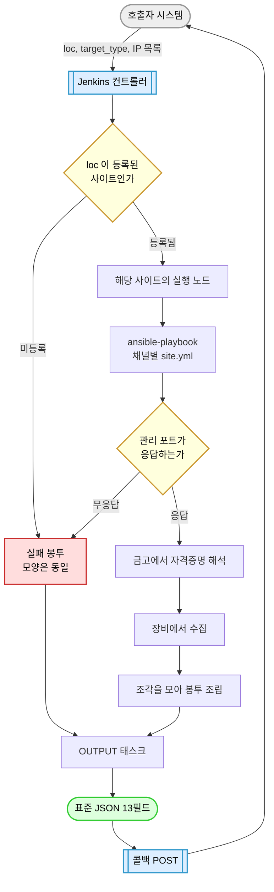

# 전체 그림

호출이 들어와서 JSON이 나갈 때까지 무슨 일이 벌어지는지 따라간다.

## 큰 줄기

> 이 그림이 말하는 것: 호출 한 번이 어떤 단계를 거쳐 표준 JSON이 되는가.

> 읽는 법: 위에서 아래로 흐른다. 노란 마름모가 갈림길이고, 빨간 상자로 빠져도 결국
> 같은 `OUTPUT` 태스크를 지난다. 그래서 실패해도 봉투 모양은 같다.

## 단계별로

### 1. 호출자가 잡을 건다

세 가지를 넘긴다 — 어느 사이트에서 실행할지(`loc`), 어느 경로로 갈지(`target_type`),
대상 IP 목록(`inventory_json`). 자격증명은 넘기지 않는다.

운영 파이프라인은 `Jenkinsfile_portal`이다. 저장소에 `Jenkinsfile`도 있지만 그
파일 자체가 주석으로 "운영 대상이 아니고 삭제 예정"이라 적어 두었다
(`Jenkinsfile:178-183`). 회귀 게이트 이관이 끝나면 정리될 것이다.

### 2. 사이트를 정한다

`Jenkinsfile_portal`의 첫 단계는 컨트롤러에서 돈다. `common/vars/locations.yml`에
등록되지 않은 `loc`이면 여기서 바로 실패시킨다. 이 단계가 없으면 잘못된 사이트 이름이
"실행 노드를 기다리는 중" 상태로 매달려 원인을 알기 어려워진다.

### 3. 관리 포트를 확인한다

수집을 시작하기 전에 대상이 응답하는지 본다. 채널별로 볼 포트가 정해져 있다 —
Redfish와 ESXi는 443, OS는 5986 → 5985 → 22 순이다. 첫 번째로 열린 포트에서 멈춘다.

여기서 중요한 게 하나 있다. **ICMP 핑은 쓰지 않는다.** 관리망은 핑을 막아 두는 경우가
흔한데, 핑으로 판정하면 멀쩡히 443으로 답하는 BMC를 죽은 장비로 오판하게 된다.
`reachable`이 참이라는 건 "TCP 연결이 됐거나 RST를 받았다"는 뜻이다
(`common/library/precheck_bundle.py:138,181`).

OS 경로는 한 걸음 더 간다. 포트가 열린 것만으로는 부족해서, 22면 SSH 배너를 읽고
5985/5986이면 인증 없이 WS-Man Identify를 던져 본다. 다른 서비스가 그 포트를 쓰고
있으면 다음 후보로 넘어간다.

### 4. 자격증명을 연다

금고 경로는 사이트와 대상 종류로 정해진다.

| 채널 | 경로 |
|---|---|
| OS | `vault/<loc>/os/{linux,windows}.yml` |
| ESXi | `vault/<loc>/esxi.yml` |
| Redfish 수집 계정 | `vault/common/redfish/standard.yml` — **전역 한 벌** |
| Redfish 복구 계정 | `vault/<loc>/redfish/<vendor>.yml` |

Redfish만 축이 둘인 이유는, 수집은 어느 사이트 어느 제조사든 같은 표준 계정으로 하고
복구만 제조사별로 다르기 때문이다. 그래서 제조사를 못 알아내도 표준 금고는 열린다.

### 5. 수집한다

채널마다 구조가 다르다. OS는 플레이가 넷이다 — 포트로 OS 종류를 가리고, 못 가린
호스트는 바로 실패 봉투로 보내고, 나머지를 Linux와 Windows로 갈라 처리한다.
ESXi와 Redfish는 플레이 하나로 끝난다.

Linux는 한 갈래가 더 있다. 대상에 Python이 없거나 3.9보다 낮으면 Ansible 모듈이 안 도는데,
그런 환경도 버려지지 않도록 셸 명령만으로 같은 결과를 만드는 경로가 따로 있다.

### 6. 조각을 모은다

각 수집 작업은 전체 JSON을 만들지 않는다. **자기가 맡은 조각만** 만들어 놓고 공용
병합기를 부른다. CPU를 수집하는 작업은 CPU 조각만 만들고, 메모리 쪽은 건드리지 않는다.

이렇게 하는 이유는 실패를 가둘 수 있기 때문이다. 저장소 수집이 실패해도 CPU 조각은
이미 모여 있으니, 결과는 전부 실패가 아니라 `partial`이 된다.

조각이 다 모이면 공용 조립기가 봉투를 만든다. 어느 채널이든 같은 조립기를 쓴다 —
그래서 세 경로의 응답 모양이 같다.

### 7. 내보낸다

봉투는 `OUTPUT`이라는 이름의 태스크에서 나간다. 이 이름은 정확히 일치해야 한다.
출력 플러그인이 태스크 이름을 문자열 그대로 비교하기 때문에
(`callback_plugins/json_only.py:366`), `OUTPUT: 결과` 같은 변형은 잡히지 않는다.
그 플러그인이 Ansible의 다른 출력을 전부 막고 이 JSON만 표준출력으로 내보낸다.

마지막 단계가 호출자에게 POST한다. 이 단계는 다시 컨트롤러에서 돈다.

## 봉투가 사라지지 않는다는 것

요청한 대상 하나당 봉투가 정확히 하나 나온다. 수집 도중 장비가 응답을 끊어 일반적인
출력 태스크까지 못 가더라도, 출력 플러그인이 호스트별 실행 흔적을 보고 빠진 봉투를
채워 넣는다.

호출자 입장에서 이건 중요한 성질이다. "IP 3개를 보냈는데 봉투가 2개 왔다"는 상황을
처리할 필요가 없다.

## 벤더 차이는 어디에 있나

수집 코드에는 제조사 이름이 없다. 차이는 두 군데에만 산다.

**어댑터 YAML** — `adapters/<채널>/` 아래에 있고, 어떤 장비에 맞는지(제조사·모델·펌웨어
패턴)와 어떤 섹션을 지원하는지를 적어 둔다. 여러 개가 맞으면 점수로 하나를 고른다.

**제조사 전용 태스크** — `redfish-gather/tasks/vendors/<vendor>/`. 표준으로는 안 나오는
확장 정보를 캐낼 때 쓴다.

그래서 벤더를 늘릴 때 파이프라인이나 수집 코드를 고치지 않는다. 자세한 규칙은
[develop/03-adapter-system.md](../develop/03-adapter-system.md)에 있다.

## 다음

- 봉투 안이 궁금하면 [contract/02-output-envelope.md](../contract/02-output-envelope.md)
- 실패했을 때 무엇을 보는지는 [contract/04-failure-and-diagnosis.md](../contract/04-failure-and-diagnosis.md)
- 코드 구조는 [develop/01-gather-structure.md](../develop/01-gather-structure.md)
